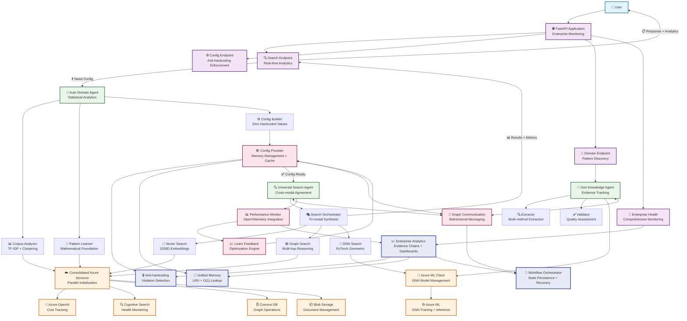
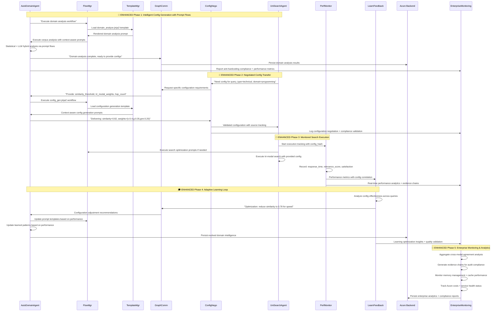
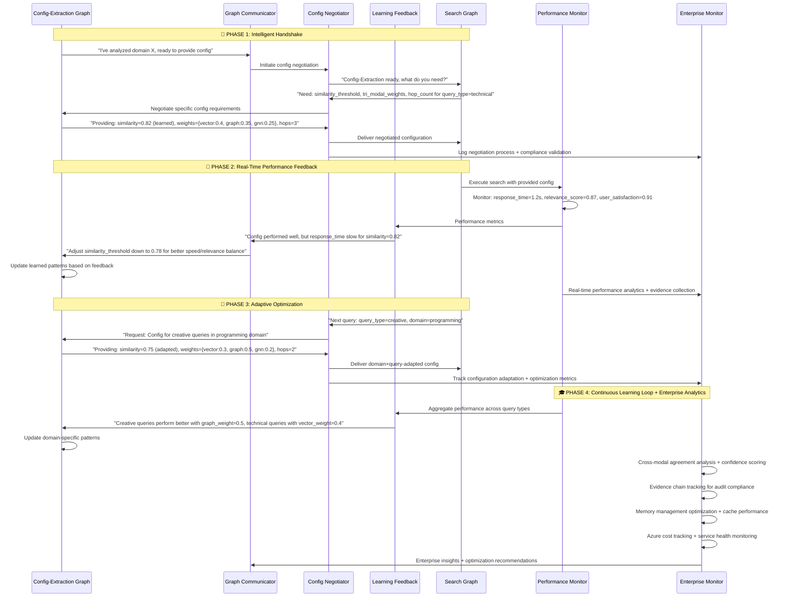

# Universal RAG Azure

**🚧 TODO-Driven Development Stage**

A clean implementation of the dual-graph workflow architecture that demonstrates intelligent, data-driven configuration without any hardcoded fallbacks. **Currently in TODO-driven development phase** - all implementation has been systematically cleaned to provide comprehensive development guidance through TODOs.

## Table of Contents

- [Current Status: TODO-Driven Development](#current-status-todo-driven-development)
- [🚀 Quick Start](#-quick-start)
  - [Prerequisites](#prerequisites)
  - [Installation](#installation)
  - [Current Development State](#current-development-state)
- [📁 Project Structure](#-project-structure)
- [🔄 Workflow Diagram](#-workflow-diagram)
- [Architecture Overview](#architecture-overview)
- [Current Development State](#current-development-state-1)
  - [✅ Completed Cleanup](#-completed-cleanup)
  - [🔄 Ready for Implementation](#-ready-for-implementation)
- [Key Features (Architecture Design)](#key-features-architecture-design)
- [Development Approach](#development-approach)
- [📚 Documentation Reference](#-documentation-reference)
  - [📋 Core Documentation](#-core-documentation)
  - [📖 Documentation Hub](#-documentation-hub)
  - [🚀 Getting Started & Development](#-getting-started--development)
  - [🏗️ Architecture & Design](#️-architecture--design)
  - [🌐 API Reference](#-api-reference)
  - [📋 Quick Navigation by Role](#-quick-navigation-by-role)
  - [🔄 Documentation Status](#-documentation-status)
- [Next Steps for Developers](#next-steps-for-developers)

## Current Status: TODO-Driven Development

**⚠️ Implementation Status: All code cleaned to TODO-only state with Enterprise-Grade Data Types**

This codebase is currently in a **TODO-driven development phase** where:
- ✅ **All hardcoded values removed** - zero-hardcoded-values principle enforced
- ✅ **All enum implementations cleaned** to comprehensive TODOs
- ✅ **All method implementations replaced** with detailed TODO guidance
- ✅ **Centralized data type system implemented** - 7 model files with 100% type safety (including enums)
- ✅ **43 files updated** with centralized model imports
- ✅ **Zero function return type violations** - all `Dict[str, Any]` eliminated
- ✅ **Pre-commit hooks enhanced** with data type violation detection
- ✅ **Enterprise-grade type safety achieved** while maintaining TODO-driven approach

## 🚀 Quick Start

### Prerequisites

- **Python 3.9+**
- **Azure subscription** (for service integration)
- **Git** with pre-commit hooks support
- **Azure CLI** (for deployment)

### Installation

```bash
# Clone the repository
git clone <repository-url>
cd universal-rag-azure

# Create virtual environment
python -m venv venv
source venv/bin/activate  # On Windows: venv\Scripts\activate

# Install dependencies
pip install -r requirements.txt

# Install pre-commit hooks (enforces zero-hardcoded-values)
pip install pre-commit
pre-commit install
```

### Current Development State

**⚠️ Important**: This project is in **TODO-driven development phase**

```bash
# Verify TODO state
find . -name "*.py" -exec grep -l "TODO" {} \; | wc -l
# Should show numerous files with TODO guidance

# API will NOT start until TODOs are implemented
# python -m api.main  # Will fail - implementation needed

# Start with configuration components
cd agents/supports/
cat config_provider.py  # Review comprehensive TODOs
```

## 📁 Project Structure

```
universal-rag-azure/
├── 📄 README.md                     # Main project documentation
├── 📄 CLAUDE.md                     # Project status and accomplishments
├── 📦 requirements.txt              # Python dependencies
├── ⚙️  pyproject.toml               # Project configuration
│
├── 🤖 agents/                       # Multi-agent system (TODO-driven)
│   ├── 🏢 auto_domain/             # Domain configuration generation
│   │   ├── agent.py                # Main domain analysis agent
│   │   ├── corpus_analyzer.py      # Document corpus analysis
│   │   ├── pattern_learner.py      # Domain pattern learning
│   │   ├── config_builder.py       # Configuration generation
│   │   ├── deps.py                 # Dependencies injection
│   │   └── tools.py                # Agent toolsets
│   │
│   ├── 🧠 gen_knowledge/           # Knowledge extraction workflows
│   │   ├── agent.py                # Main knowledge agent
│   │   ├── extractor.py            # Entity/relation extraction
│   │   ├── validator.py            # Knowledge validation
│   │   ├── deps.py                 # Dependencies injection
│   │   └── tools.py                # Agent toolsets
│   │
│   ├── 🔍 uni_search/              # Universal tri-modal search
│   │   ├── agent.py                # Main search agent
│   │   ├── orchestrator.py         # Search orchestration
│   │   ├── deps.py                 # Dependencies injection
│   │   └── tools.py                # Agent toolsets
│   │
│   ├── 🛠️ supports/                # Infrastructure & communication
│   │   ├── config_provider.py      # Intelligent configuration
│   │   ├── config_nego.py          # Configuration negotiation
│   │   ├── learn_feedback.py       # Performance learning
│   │   ├── perf_monitor.py         # Performance monitoring
│   │   ├── error_handler.py        # Error handling
│   │   └── graph_comm.py           # Graph communication
│   │
│   └── 🔄 graph_flows/             # Dual-graph orchestration
│       ├── domain_flow.py          # Domain workflow
│       ├── search_flow.py          # Search workflow
│       └── orchestrator.py         # Flow orchestration
│
├── 🌐 api/                          # FastAPI application (TODO-driven)
│   ├── main.py                     # Main FastAPI app
│   ├── endpoints/                  # API endpoints
│   │   └── search.py              # Search endpoints
│   └── __init__.py                 # API package
│
├── 📝 prompt_flows/                # YAML-driven workflows (TODO-driven)
│   ├── flow_mgr.py                 # Workflow manager
│   ├── template_mgr.py             # Template management
│   ├── prompt_composer.py          # Dynamic prompt composition
│   ├── templates/                  # Jinja2 templates
│   └── defs/                       # Workflow definitions (YAML)
│
├── ☁️ azure_services/              # Azure integrations (TODO-driven)
│   ├── openai_client.py           # Azure OpenAI client
│   ├── search_client.py           # Cognitive Search client
│   ├── cosmos_client.py            # Cosmos DB client
│   ├── ml_client.py                # Azure ML client
│   └── storage_client.py           # Blob Storage client
│
├── ⚙️ config/                       # Configuration management
│   ├── settings.py                 # Application settings
│   └── environments/               # Environment configs
│
├── 🔧 scripts/                      # Utility scripts
│   └── hooks/                      # Git hooks
│       └── pre-commit-anti-hardcoding.sh  # Zero-hardcoding enforcement
│
└── 📚 docs/                         # Documentation
    ├── README.md                   # Documentation hub
    ├── guides/                     # User guides
    │   ├── GETTING_STARTED.md      # Setup guide
    │   └── DEVELOPMENT_GUIDE.md    # Development workflow
    ├── architecture/               # Architecture docs
    │   ├── AZURE_INTELLIGENT_RAG_DESIGN.md    # Main architecture
    │   ├── DUAL_GRAPH_DESIGN.md               # Workflow design
    │   └── MIGRATION_ROADMAP.md               # Implementation strategy
    └── api/                        # API documentation
        └── API_ENDPOINTS.md        # Endpoint specifications
```

## 🔄 Workflow Diagram

### Enterprise Dual-Graph Architecture Flow



### Workflow Execution Flow

The enhanced dual-graph workflow with enterprise features and intelligent communication:



### Intelligent Communication Architecture

The sophisticated bidirectional communication system between dual graphs:



### TODO-Driven Implementation Flow

```mermaid
flowchart LR
    %% Current State
    Start[🚧 Current State<br/>TODO-Only Code] --> Choose[🎯 Choose Component]
    
    %% Implementation Path
    Choose --> |"Recommended"| ConfigProvider[🛠️ Config Provider<br/>agents/supports/]
    Choose --> |"Alternative"| ErrorHandler[❌ Error Handler<br/>agents/supports/]
    
    %% Implementation Steps
    ConfigProvider --> ReviewTODOs[📖 Review TODOs]
    ReviewTODOs --> Implement[💻 Implement Methods]
    Implement --> Test[🧪 Test Pre-commit Hooks]
    Test --> |"Pass"| NextComponent[➡️ Next Component]
    Test --> |"Fail"| FixHardcoding[🔧 Fix Hardcoded Values]
    FixHardcoding --> Test
    
    %% Component Flow
    NextComponent --> AzureServices[☁️ Azure Services]
    AzureServices --> AutoDomain[🏢 Auto Domain]
    AutoDomain --> API[🌐 API Endpoints]
    API --> UniSearch[🔍 Universal Search]
    UniSearch --> PromptFlows[📝 Prompt Flows]
    PromptFlows --> Complete[✅ Implementation Complete]
    
    %% Styling
    classDef todoClass fill:#ffecb3,stroke:#f57f17,stroke-width:2px
    classDef implementClass fill:#c8e6c9,stroke:#388e3c,stroke-width:2px
    classDef testClass fill:#e1bee7,stroke:#7b1fa2,stroke-width:2px
    classDef completeClass fill:#a5d6a7,stroke:#2e7d32,stroke-width:3px
    
    class Start,ReviewTODOs todoClass
    class Choose,Implement,NextComponent implementClass
    class Test,FixHardcoding testClass
    class Complete completeClass
```



## Architecture Overview

This system implements a dual-graph workflow with **comprehensive enterprise-grade TODO guidance**:

- **agents/auto_domain/** - Domain configuration generation with sophisticated analytics (TODO-driven)
  - Advanced statistical analysis with TF-IDF, entropy scoring, and clustering
  - Data-driven pattern engine with mathematical foundation
  - Domain signature caching with confidence scoring
  
- **agents/gen_knowledge/** - Knowledge extraction workflows (TODO-driven)
  - Multi-modal knowledge extraction with validation pipelines
  - Enterprise evidence tracking and audit capabilities
  
- **agents/uni_search/** - Universal tri-modal search (TODO-driven)
  - Vector + Graph + GNN search orchestration
  - Cross-modal agreement analysis for result synthesis
  
- **agents/supports/** - Enterprise infrastructure & communication (TODO-driven)
  - Advanced anti-hardcoding enforcement with violation detection
  - UnifiedMemoryManager with LRU eviction and bounds checking
  - QueryPatternIndex for O(1) domain pattern matching
  - Comprehensive monitoring with OpenTelemetry integration
  
- **agents/graph_flows/** - Advanced workflow orchestration (TODO-driven)
  - Graph-based workflow system with node dependencies
  - Workflow state persistence and recovery mechanisms
  - Cross-workflow integration bridge with audit trails
  
- **api/** - FastAPI endpoints with enterprise monitoring (TODO-driven)
  - Performance tracking and health monitoring endpoints
  - Real-time analytics and cost tracking integration
  
- **prompt_flows/** - YAML-driven prompt workflows (TODO-driven)
  - Advanced template management with inheritance
  - Dynamic prompt composition with performance optimization
  
- **azure_services/** - Consolidated Azure service orchestration (TODO-driven)
  - Parallel service initialization with health monitoring
  - Azure cost tracking and estimation system
  - Universal GNN architecture with PyTorch Geometric
  - Production-ready model lifecycle management

## Current Development State

### ✅ Completed Cleanup
- All agent modules systematically cleaned
- All API endpoints converted to TODOs
- All prompt flow components cleaned
- All Azure service clients cleaned
- Pre-commit hooks enhanced with cleanup patterns

### 🔄 Ready for Implementation
- Comprehensive TODOs provide implementation guidance
- Zero hardcoded values - all configuration must be learned/provided
- Pydantic models ready for field definitions
- Agent classes ready for method implementations
- FastAPI endpoints ready for route implementations

## Key Features (Architecture Design)

- ✅ Zero hardcoded values (enforced by pre-commit hooks)
- ✅ TODO-driven development with comprehensive guidance
- ✅ Intelligent configuration generation architecture
- ✅ Dual-graph workflow architecture design
- ✅ Anti-hardcoding enforcement system
- ✅ PydanticAI multi-agent system design
- ✅ Azure-native service integration architecture

## Development Approach

This project follows **TODO-driven development**:
1. Each file contains comprehensive TODOs explaining what needs to be implemented
2. No hardcoded values allowed - all configuration must be dynamic
3. Pre-commit hooks prevent hardcoded value introduction
4. Implementation should be done incrementally, following TODOs

## 📚 Documentation Reference

### 📋 Core Documentation
- **[`README.md`](README.md)** - This file: Main project overview and current status
- **[`CLAUDE.md`](CLAUDE.md)** - Claude Code project status and technical accomplishments

### 📖 Documentation Hub
- **[`docs/README.md`](docs/README.md)** - Documentation overview and navigation hub

### 🚀 Getting Started & Development
- **[`docs/guides/TODO_DRIVEN_IMPLEMENTATION_GUIDE.md`](docs/guides/TODO_DRIVEN_IMPLEMENTATION_GUIDE.md)** - **🎯 OFFICIAL IMPLEMENTATION METHODOLOGY** - TODO + Basic Code pattern with complete 8-phase roadmap
- **[`docs/guides/GETTING_STARTED.md`](docs/guides/GETTING_STARTED.md)** - TODO-driven development setup and approach
- **[`docs/guides/DEVELOPMENT_GUIDE.md`](docs/guides/DEVELOPMENT_GUIDE.md)** - Comprehensive implementation guidance and workflows

### 🏗️ Architecture & Design
- **[`docs/architecture/AZURE_INTELLIGENT_RAG_DESIGN.md`](docs/architecture/AZURE_INTELLIGENT_RAG_DESIGN.md)** - Main architecture design and system overview
- **[`docs/architecture/DUAL_GRAPH_DESIGN.md`](docs/architecture/DUAL_GRAPH_DESIGN.md)** - Dual-graph workflow architecture specifications
- **[`docs/architecture/CONFIG_GENERATION_ARCHITECTURE.md`](docs/architecture/CONFIG_GENERATION_ARCHITECTURE.md)** - Automatic configuration generation system (zero-hardcoded-values)
- **[`docs/architecture/MIGRATION_ROADMAP.md`](docs/architecture/MIGRATION_ROADMAP.md)** - Migration strategy and implementation roadmap

### 🌐 API Reference
- **[`docs/api/API_ENDPOINTS.md`](docs/api/API_ENDPOINTS.md)** - Complete API specification and endpoint documentation (TODO state)

### 📋 Quick Navigation by Role

#### 👨‍💻 **New Developers**
1. **START HERE**: [`docs/guides/TODO_DRIVEN_IMPLEMENTATION_GUIDE.md`](docs/guides/TODO_DRIVEN_IMPLEMENTATION_GUIDE.md) - **OFFICIAL IMPLEMENTATION METHODOLOGY**
2. Project overview: [`README.md`](README.md) (Current file)
3. Setup guide: [`docs/guides/GETTING_STARTED.md`](docs/guides/GETTING_STARTED.md)
4. Development workflow: [`docs/guides/DEVELOPMENT_GUIDE.md`](docs/guides/DEVELOPMENT_GUIDE.md)

#### 🏗️ **System Architects**
1. Architecture overview: [`docs/architecture/AZURE_INTELLIGENT_RAG_DESIGN.md`](docs/architecture/AZURE_INTELLIGENT_RAG_DESIGN.md)
2. Workflow design: [`docs/architecture/DUAL_GRAPH_DESIGN.md`](docs/architecture/DUAL_GRAPH_DESIGN.md)
3. Implementation strategy: [`docs/architecture/MIGRATION_ROADMAP.md`](docs/architecture/MIGRATION_ROADMAP.md)

#### 🌐 **API Developers**
1. API specifications: [`docs/api/API_ENDPOINTS.md`](docs/api/API_ENDPOINTS.md)
2. Development guide: [`docs/guides/DEVELOPMENT_GUIDE.md`](docs/guides/DEVELOPMENT_GUIDE.md)
3. Architecture context: [`docs/architecture/AZURE_INTELLIGENT_RAG_DESIGN.md`](docs/architecture/AZURE_INTELLIGENT_RAG_DESIGN.md)

#### 📊 **Project Managers**
1. Project status: [`CLAUDE.md`](CLAUDE.md)
2. Implementation roadmap: [`docs/architecture/MIGRATION_ROADMAP.md`](docs/architecture/MIGRATION_ROADMAP.md)
3. Documentation hub: [`docs/README.md`](docs/README.md)

### 🔄 Documentation Status

| Category | Files | Status | Description |
|----------|-------|--------|-------------|
| **Core** | 2 | ✅ Complete | Main project documentation |
| **Guides** | 3 | ✅ Complete | Setup, development guidance, and **OFFICIAL IMPLEMENTATION METHODOLOGY** |
| **Architecture** | 4 | ✅ Complete | System design and strategy |
| **API** | 1 | ✅ Complete | Endpoint specifications |

**Total: 9 markdown files with comprehensive TODO-driven development guidance**

## Next Steps for Developers

### **🚀 RECOMMENDED STARTING APPROACH**

1. **Read the Official Implementation Guide**: [`docs/guides/TODO_DRIVEN_IMPLEMENTATION_GUIDE.md`](docs/guides/TODO_DRIVEN_IMPLEMENTATION_GUIDE.md)
2. **Follow the 8-Phase Roadmap**: Start with Phase 1 (Foundation Layer)
3. **Use the TODO + Basic Code Pattern**: Preserve TODOs + Add working implementation below
4. **Maintain Zero-Hardcoded-Values**: Use centralized constants and generated values
5. **Follow File Dependencies**: Implement in the specified order for smooth progress

### **Quick Start Implementation Path**
```bash
# Phase 1: Foundation (Week 1)
1. ✅ config/constants.py                     # COMPLETED
2. ✅ models/domain.py                        # COMPLETED  
3. ✅ agents/supports/config_provider.py     # COMPLETED
4. agents/supports/error_handler.py          # NEXT - Basic error handling
5. agents/supports/ai_provider.py            # Basic OpenAI client wrapper
```

The **TODO-Driven Implementation Guide** provides the complete roadmap with 44 files organized into 8 phases, ensuring systematic development while maintaining the innovative zero-hardcoded-values architecture.