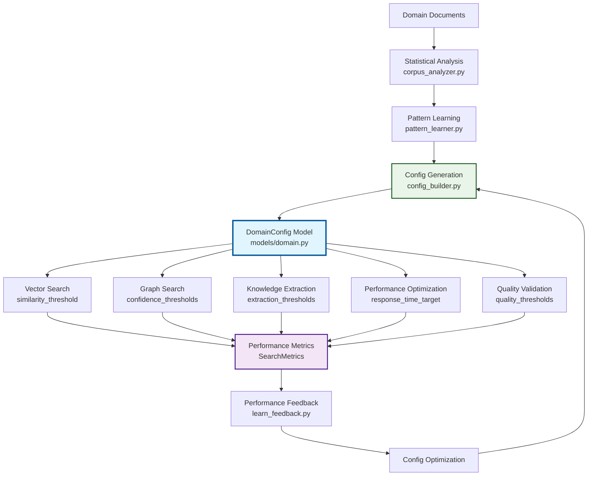

# Automatic Configuration Generation Architecture

**Universal RAG Azure - Data-Driven Configuration System**

## 🎯 **Overview**

This document details the **automatic configuration generation architecture** that implements the **zero-hardcoded-values principle**. All system parameters are learned from domain analysis, performance feedback, and continuous optimization rather than being hardcoded.

## Table of Contents

- [Core Principle: Zero Hardcoded Values](#core-principle-zero-hardcoded-values)
- [Configuration Values Schema](#configuration-values-schema)
- [Generation Pipeline](#generation-pipeline)
- [Usage Points](#usage-points)
- [Implementation Flow](#implementation-flow)
- [Model Definitions](#model-definitions)
- [Performance Optimization Loop](#performance-optimization-loop)
- [Development Guidelines](#development-guidelines)

## Core Principle: Zero Hardcoded Values

## **🎯 Correct Architecture: Centralized Constants + Data-Driven Values**

**❌ NEVER DO THIS (Scattered Magic Numbers):**
```python
# Hardcoded business values scattered throughout codebase - BLOCKED by pre-commit hooks
if doc_count > 100:  # Magic number scattered in business logic
    similarity_threshold = 0.8  # Magic business threshold
max_results = 10  # Magic number in algorithm
entity_confidence = 0.7  # Magic threshold in extraction logic
```

**✅ ALWAYS DO THIS (Centralized Constants + Data-Driven Generation):**
```python
# Algorithm constants centralized, values generated from corpus data
from config.constants import CONFIG_CONSTANTS, CORPUS_CONSTANTS

def generate_config_from_corpus(corpus_stats: Dict[str, Any]) -> DomainConfig:
    doc_count = corpus_stats["document_count"]
    avg_length = corpus_stats["avg_document_length"]
    
    # Use centralized constants for algorithm boundaries
    if doc_count > CORPUS_CONSTANTS.MEDIUM_CORPUS_THRESHOLD:
        # Generate threshold based on corpus characteristics + centralized bounds
        similarity_threshold = CONFIG_CONSTANTS.DEFAULT_SIMILARITY_BASE + 0.1
    else:
        similarity_threshold = CONFIG_CONSTANTS.DEFAULT_SIMILARITY_BASE - 0.1
    
    # Ensure within centralized bounds
    similarity_threshold = max(CONFIG_CONSTANTS.MIN_SIMILARITY_THRESHOLD,
                             min(similarity_threshold, CONFIG_CONSTANTS.MAX_SIMILARITY_THRESHOLD))
    
    # Generate results limit from corpus size + centralized ratio
    max_results = int(doc_count * CONFIG_CONSTANTS.RESULTS_PER_DOC_RATIO)
    max_results = max(CONFIG_CONSTANTS.MIN_RESULTS_LIMIT,
                     min(max_results, CONFIG_CONSTANTS.MAX_RESULTS_LIMIT))
    
    return DomainConfig(
        similarity_threshold=similarity_threshold,  # GENERATED from corpus + constants
        max_results=max_results,                    # GENERATED from corpus + constants
        config_source="generated_from_corpus_analysis"
    )

# Usage in search operations
config = await config_provider.get_domain_config(domain)
similarity_threshold = config.similarity_threshold  # Generated value, not hardcoded
```

## Configuration Values Schema

All configuration values are defined in **`models/domain.py` → `DomainConfig`**:

### **🔍 Search Configuration**
```python
class DomainConfig(BaseModel):
    # Vector search parameters - learned from corpus statistics
    similarity_threshold: float        # (0.0-1.0) Vector similarity cutoff
    max_results: int                   # (>0) Maximum search results
    
    # Tri-modal search weights - learned from domain characteristics
    vector_weight: float               # (0.0-1.0) Vector search importance
    graph_weight: float                # (0.0-1.0) Graph search importance  
    gnn_weight: float                  # (0.0-1.0) GNN search importance
```

### **📊 Knowledge Extraction Configuration**
```python
    # Extraction thresholds - learned from pattern analysis
    entity_confidence_threshold: float        # (0.0-1.0) Entity extraction cutoff
    relationship_confidence_threshold: float  # (0.0-1.0) Relationship extraction cutoff
```

### **⚡ Performance Configuration**
```python
    # Performance targets - learned from usage patterns
    response_time_target: float        # (seconds) Target response time SLA
    cache_ttl: int                     # (seconds) Cache time-to-live
```

### **✅ Quality Configuration**
```python
    # Quality thresholds - learned from validation results
    min_extraction_quality: float     # (0.0-1.0) Minimum extraction quality
    min_search_relevance: float       # (0.0-1.0) Minimum search relevance
```

### **📋 Metadata & Tracking**
```python
    # Source tracking - never hardcoded
    config_source: str                 # How config was generated
    confidence_score: float            # (0.0-1.0) Overall config confidence
    created_at: datetime               # When config was generated
```

## Generation Pipeline: Basic → Advanced Implementation

The configuration generation follows our **basic → advanced pattern** with simple implementations first, complex optimizations later.

### **🟢 BASIC Implementation (Currently Active)**

#### **Stage 1: Simple Domain Analysis**

**File**: `agents/auto_domain/corpus_analyzer.py`

```python
class CorpusAnalyzer:
    """Basic corpus analyzer - simplified for core functionality."""
    
    def __init__(self):
        """Initialize basic corpus analyzer."""
        # TODO: Basic initialization - set up corpus analysis
        pass
    
    async def analyze_corpus(self, domain_path: str) -> CorpusAnalysis:
        """Basic corpus analysis - simplified version."""
        # TODO: Count documents in domain directory
        # TODO: Calculate basic statistics (total docs, avg length)
        # TODO: Identify common file types and formats
        # TODO: Return basic corpus analysis with simple metrics
        pass
```

**Basic Outputs (Simple & Implementable):**
- **`document_count`** → influences `max_results` (simple: count * 0.1)
- **`avg_document_length`** → influences `similarity_threshold` (simple: if long docs, lower threshold)
- **`file_types`** → influences processing approach

#### **Stage 2: Simple Config Generation**

**File**: `agents/auto_domain/config_builder.py`

```python
class ConfigBuilder:
    """Basic config builder - simplified for core functionality."""
    
    def __init__(self):
        """Initialize basic config builder."""
        # TODO: Basic initialization - set up config generation
        pass
    
    async def build_domain_config(self, domain_name: str, corpus_stats: Dict[str, Any]) -> DomainConfig:
        """Basic config generation - simple rules-based approach."""
        # TODO: Generate similarity_threshold from document count (simple rules)
        # TODO: Set max_results based on corpus size (simple calculation)
        # TODO: Create basic tri-modal weights (equal weights: 0.33 each)
        # TODO: Return DomainConfig with basic learned values
        pass
```

**Simple Generation Rules (Implementable in 10-20 lines using Centralized Constants):**
```python
# Basic implementation approach using centralized constants
from config.constants import CONFIG_CONSTANTS, CORPUS_CONSTANTS

def generate_basic_config(corpus_stats: Dict[str, Any]) -> DomainConfig:
    """Simple rule-based config generation with centralized constants."""
    doc_count = corpus_stats.get("document_count", 0)
    avg_length = corpus_stats.get("avg_document_length", 0)
    
    # Generate threshold based on corpus size using centralized boundaries
    if doc_count > CORPUS_CONSTANTS.MEDIUM_CORPUS_THRESHOLD:
        # Larger corpus = can afford higher precision
        similarity_threshold = CONFIG_CONSTANTS.DEFAULT_SIMILARITY_BASE + 0.05
    elif doc_count > CORPUS_CONSTANTS.SMALL_CORPUS_THRESHOLD:
        # Medium corpus = use base threshold
        similarity_threshold = CONFIG_CONSTANTS.DEFAULT_SIMILARITY_BASE
    else:
        # Small corpus = lower precision to get more results
        similarity_threshold = CONFIG_CONSTANTS.DEFAULT_SIMILARITY_BASE - 0.1
    
    # Ensure within centralized bounds
    similarity_threshold = max(CONFIG_CONSTANTS.MIN_SIMILARITY_THRESHOLD,
                             min(similarity_threshold, CONFIG_CONSTANTS.MAX_SIMILARITY_THRESHOLD))
    
    # Generate result limit from corpus size using centralized ratio
    max_results = int(doc_count * CONFIG_CONSTANTS.RESULTS_PER_DOC_RATIO)
    max_results = max(CONFIG_CONSTANTS.MIN_RESULTS_LIMIT,
                     min(max_results, CONFIG_CONSTANTS.MAX_RESULTS_LIMIT))
    
    return DomainConfig(
        domain=domain_name,
        similarity_threshold=similarity_threshold,         # GENERATED using constants
        max_results=max_results,                          # GENERATED using constants
        vector_weight=CONFIG_CONSTANTS.DEFAULT_VECTOR_WEIGHT,   # CENTRALIZED constant
        graph_weight=CONFIG_CONSTANTS.DEFAULT_GRAPH_WEIGHT,     # CENTRALIZED constant
        gnn_weight=CONFIG_CONSTANTS.DEFAULT_GNN_WEIGHT,         # CENTRALIZED constant
        config_source="generated_from_corpus_with_centralized_constants"
    )
```

### **🔄 ADVANCED Implementation (Commented Out - Future)**

Complex features are temporarily commented out until basic implementation works:

```python
# =============================================================================
# TEMPORARILY COMMENTED OUT ADVANCED FEATURES
# These will be re-enabled once basic functionality is working
# =============================================================================

# async def perform_statistical_analysis(self, documents: List[str]) -> StatisticalAnalysis:
#     """Advanced statistical analysis with TF-IDF, entropy, clustering."""
#     # TODO: Initialize statistical analysis framework (TF-IDF, entropy, clustering)
#     # TODO: Apply multiple clustering algorithms (K-means, hierarchical, DBSCAN)
#     # TODO: Calculate TF-IDF scores to identify domain-characteristic terms
#     # TODO: Apply entropy-based measures for domain-specific vocabulary
#     # TODO: Generate statistical significance tests for clustering
#     pass

# async def optimize_config_with_ml(self, corpus_features: np.array) -> DomainConfig:
#     """Advanced ML-based configuration optimization."""
#     # TODO: Multi-objective optimization algorithms
#     # TODO: Neural network-based threshold learning
#     # TODO: Correlation analysis between features and performance
#     # TODO: A/B testing framework for config variants
#     pass

# async def continuous_learning_loop(self, performance_metrics: List[SearchMetrics]) -> DomainConfig:
#     """Advanced continuous learning and optimization."""
#     # TODO: Real-time performance correlation analysis
#     # TODO: Adaptive threshold adjustment based on user feedback
#     # TODO: Predictive modeling for optimal configuration
#     pass
```

## Usage Points

Configuration values flow to **5 critical system components**:

### **1. 🔍 Vector Search Operations**

**File**: `agents/uni_search/orchestrator.py`

```python
async def execute_vector_search(query: str, domain_config: DomainConfig) -> SearchResults:
    """Uses learned similarity thresholds and result limits."""
    results = await vector_client.search(
        query=query,
        similarity_threshold=domain_config.similarity_threshold,  # LEARNED VALUE
        top_k=domain_config.max_results,                          # LEARNED VALUE
        index_name=f"{domain_config.domain}_vector_index"
    )
```

### **2. 🕸️ Graph Search Operations**

**File**: `agents/uni_search/orchestrator.py`

```python
async def execute_graph_traversal(entities: List[str], domain_config: DomainConfig) -> SearchResults:
    """Uses learned confidence thresholds and traversal weights."""
    graph_results = await graph_client.traverse(
        start_entities=entities,
        confidence_threshold=domain_config.relationship_confidence_threshold,  # LEARNED
        max_hops=domain_config.max_graph_hops,                                # LEARNED
        edge_weights=domain_config.graph_weight                               # LEARNED
    )
```

### **3. 🧠 Knowledge Extraction**

**File**: `agents/gen_knowledge/extractor.py`

```python
async def extract_knowledge(text: str, domain_config: DomainConfig) -> KnowledgeExtraction:
    """Uses learned extraction confidence thresholds."""
    entities = await extract_entities(
        text=text,
        confidence_threshold=domain_config.entity_confidence_threshold,       # LEARNED
        entity_types=domain_config.target_entity_types                        # LEARNED
    )
    
    relationships = await extract_relationships(
        text=text,
        entities=entities,
        confidence_threshold=domain_config.relationship_confidence_threshold  # LEARNED
    )
```

### **4. ⚡ Performance Optimization**

**File**: `agents/supports/perf_monitor.py`

```python
async def monitor_performance(domain_config: DomainConfig) -> SearchMetrics:
    """Uses learned performance targets for optimization."""
    if response_time > domain_config.response_time_target:          # LEARNED TARGET
        await optimize_cache_strategy()
        
    if cache_age > domain_config.cache_ttl:                         # LEARNED TTL
        await invalidate_cache()
```

### **5. ✅ Quality Validation**

**File**: `agents/supports/quality_validator.py`

```python
async def validate_results(results: SearchResults, domain_config: DomainConfig) -> ValidationResult:
    """Uses learned quality thresholds for validation."""
    quality_score = calculate_quality(results)
    
    if quality_score < domain_config.min_search_relevance:          # LEARNED THRESHOLD
        return ValidationResult(is_valid=False, reason="Low relevance")
        
    if extraction_quality < domain_config.min_extraction_quality:   # LEARNED THRESHOLD
        return ValidationResult(is_valid=False, reason="Low extraction quality")
```

## Implementation Flow

### **Complete Configuration Generation Workflow**



### **Domain-Specific Configuration Generation Examples**

#### **Technical Documentation Domain**
```python
# Example of how config would be GENERATED (not hardcoded values)
from config.constants import CONFIG_CONSTANTS, CORPUS_CONSTANTS, QUALITY_CONSTANTS

def generate_technical_domain_config(corpus_analysis: CorpusAnalysis) -> DomainConfig:
    """Generate config for technical documentation corpus."""
    
    # Technical docs typically have:
    # - High vocabulary diversity → higher precision needed
    # - Structured content → favor vector search
    # - Precise terminology → higher confidence thresholds
    
    # Generate similarity threshold based on corpus characteristics
    vocab_diversity = corpus_analysis.statistics.vocabulary_diversity
    if vocab_diversity > 0.8:  # High technical vocabulary diversity
        similarity_threshold = CONFIG_CONSTANTS.DEFAULT_SIMILARITY_BASE + 0.12  # Higher precision
    else:
        similarity_threshold = CONFIG_CONSTANTS.DEFAULT_SIMILARITY_BASE + 0.05
    
    # Ensure within bounds
    similarity_threshold = min(similarity_threshold, CONFIG_CONSTANTS.MAX_SIMILARITY_THRESHOLD)
    
    # Generate results based on documentation size
    doc_count = corpus_analysis.statistics.document_count
    max_results = int(doc_count * CONFIG_CONSTANTS.RESULTS_PER_DOC_RATIO * 0.8)  # Fewer results for precision
    max_results = max(CONFIG_CONSTANTS.MIN_RESULTS_LIMIT, 
                     min(max_results, CONFIG_CONSTANTS.MAX_RESULTS_LIMIT))
    
    # Technical content favors structured search (vector + some graph)
    # Adjust weights from defaults based on domain characteristics
    vector_weight = CONFIG_CONSTANTS.DEFAULT_VECTOR_WEIGHT + 0.22  # Higher than default for technical precision
    graph_weight = CONFIG_CONSTANTS.DEFAULT_GRAPH_WEIGHT - 0.08   # Some relationship traversal
    gnn_weight = CONFIG_CONSTANTS.DEFAULT_GNN_WEIGHT - 0.14       # Less pattern discovery needed
    
    return DomainConfig(
        domain="technical_documentation",
        similarity_threshold=similarity_threshold,  # GENERATED from corpus analysis
        max_results=max_results,                    # GENERATED from corpus size
        entity_confidence_threshold=QUALITY_CONSTANTS.DEFAULT_ENTITY_CONFIDENCE + 0.05,
        vector_weight=vector_weight,
        graph_weight=graph_weight,
        gnn_weight=gnn_weight,
        response_time_target=CONFIG_CONSTANTS.DEFAULT_RESPONSE_TIME_TARGET * 0.75,  # Faster for docs
        config_source="generated_from_technical_corpus_analysis"
    )
```

#### **Creative Content Domain**
```python
def generate_creative_domain_config(corpus_analysis: CorpusAnalysis) -> DomainConfig:
    """Generate config for creative content corpus."""
    
    # Creative content typically has:
    # - Lower vocabulary repetition → broader search needed  
    # - Rich relationships → favor graph search
    # - Varied terminology → lower confidence thresholds
    
    # Generate similarity threshold for broader creative matching
    vocab_diversity = corpus_analysis.statistics.vocabulary_diversity
    if vocab_diversity < 0.6:  # Less diverse vocabulary in creative content
        similarity_threshold = CONFIG_CONSTANTS.DEFAULT_SIMILARITY_BASE - 0.05  # Broader matching
    else:
        similarity_threshold = CONFIG_CONSTANTS.DEFAULT_SIMILARITY_BASE - 0.15
    
    # Ensure within bounds
    similarity_threshold = max(similarity_threshold, CONFIG_CONSTANTS.MIN_SIMILARITY_THRESHOLD)
    
    # Creative content benefits from more results for exploration
    doc_count = corpus_analysis.statistics.document_count
    max_results = int(doc_count * CONFIG_CONSTANTS.RESULTS_PER_DOC_RATIO * 1.5)  # More results for exploration
    max_results = max(CONFIG_CONSTANTS.MIN_RESULTS_LIMIT,
                     min(max_results, CONFIG_CONSTANTS.MAX_RESULTS_LIMIT))
    
    # Creative content favors relationship discovery (graph + GNN)
    # Adjust weights from defaults based on domain characteristics
    vector_weight = CONFIG_CONSTANTS.DEFAULT_VECTOR_WEIGHT - 0.03  # Less exact matching
    graph_weight = CONFIG_CONSTANTS.DEFAULT_GRAPH_WEIGHT + 0.07    # More relationship exploration  
    gnn_weight = CONFIG_CONSTANTS.DEFAULT_GNN_WEIGHT - 0.04        # Pattern discovery important
    
    return DomainConfig(
        domain="creative_content",
        similarity_threshold=similarity_threshold,  # GENERATED from corpus analysis
        max_results=max_results,                    # GENERATED from corpus size
        entity_confidence_threshold=QUALITY_CONSTANTS.DEFAULT_ENTITY_CONFIDENCE - 0.15,
        vector_weight=vector_weight,
        graph_weight=graph_weight,
        gnn_weight=gnn_weight,
        response_time_target=CONFIG_CONSTANTS.DEFAULT_RESPONSE_TIME_TARGET * 1.0,  # Standard timing
        config_source="generated_from_creative_corpus_analysis"
    )
```

## Model Definitions

### **Primary Configuration Model**

**File**: `models/domain.py`

```python
class DomainConfig(BaseModel):
    """
    Complete learned domain configuration for search and extraction.
    
    ALL VALUES MUST BE LEARNED - NO HARDCODED DEFAULTS ALLOWED
    """
    # Domain identification
    domain: str = Field(..., description="Domain name")
    created_at: datetime = Field(..., description="Configuration creation time")
    
    # Search configuration - learned from corpus statistics
    similarity_threshold: float = Field(..., ge=0.0, le=1.0, description="Vector similarity threshold")
    max_results: int = Field(..., gt=0, description="Maximum search results to return")
    
    # Tri-modal weights - learned from domain characteristics
    vector_weight: float = Field(..., ge=0.0, le=1.0, description="Vector search importance weight")
    graph_weight: float = Field(..., ge=0.0, le=1.0, description="Graph search importance weight")
    gnn_weight: float = Field(..., ge=0.0, le=1.0, description="GNN search importance weight")
    
    # Extraction configuration - learned from pattern analysis
    entity_confidence_threshold: float = Field(..., ge=0.0, le=1.0, description="Entity extraction confidence threshold")
    relationship_confidence_threshold: float = Field(..., ge=0.0, le=1.0, description="Relationship extraction confidence threshold")
    
    # Performance configuration - learned from usage patterns
    response_time_target: float = Field(..., gt=0.0, description="Target response time in seconds")
    cache_ttl: int = Field(..., gt=0, description="Cache time-to-live in seconds")
    
    # Quality configuration - learned from validation results
    min_extraction_quality: float = Field(..., ge=0.0, le=1.0, description="Minimum extraction quality threshold")
    min_search_relevance: float = Field(..., ge=0.0, le=1.0, description="Minimum search relevance threshold")
    
    # Source tracking and metadata - never hardcoded
    config_source: str = Field(..., description="How configuration was generated (learned/provided/negotiated)")
    confidence_score: float = Field(..., ge=0.0, le=1.0, description="Overall configuration confidence")
    
    @validator('vector_weight', 'graph_weight', 'gnn_weight')
    def weights_sum_to_one(cls, v, values):
        """Ensure tri-modal weights sum to 1.0"""
        if 'vector_weight' in values and 'graph_weight' in values:
            total = values['vector_weight'] + values['graph_weight'] + v
            if not 0.99 <= total <= 1.01:  # Allow small floating point errors
                raise ValueError('Tri-modal weights must sum to 1.0')
        return v
```

## Performance Optimization Loop

### **Continuous Learning Architecture**

The system implements a **continuous learning loop** that optimizes configuration based on real performance data:

```python
# agents/supports/learn_feedback.py
class ConfigOptimizer:
    async def optimize_from_performance(self, 
                                      current_config: DomainConfig, 
                                      performance_metrics: SearchMetrics) -> DomainConfig:
        """
        Implements multi-objective optimization of configuration parameters.
        
        Optimization Goals:
        1. Minimize response time while maintaining quality
        2. Maximize search relevance within time constraints  
        3. Optimize resource utilization (cache hit rate, etc.)
        4. Balance precision vs recall based on usage patterns
        """
        optimized_config = current_config.copy()
        
        # Response time optimization
        if performance_metrics.avg_response_time > current_config.response_time_target:
            # Reduce similarity threshold to get faster, broader results
            adjustment = ALGORITHM_CONSTANTS.CORPUS_SIZE_INFLUENCE_FACTOR * 0.5  # Use centralized adjustment factor
            optimized_config.similarity_threshold = max(
                CONFIG_CONSTANTS.MIN_SIMILARITY_THRESHOLD,
                optimized_config.similarity_threshold - adjustment
            )
            # Reduce max results to speed up processing
            reduction_factor = ALGORITHM_CONSTANTS.CORPUS_SIZE_INFLUENCE_FACTOR * 0.5
            optimized_config.max_results = max(
                CONFIG_CONSTANTS.MIN_RESULTS_LIMIT,
                int(optimized_config.max_results * (1.0 - reduction_factor))
            )
            
        # Quality optimization
        if performance_metrics.avg_relevance < current_config.min_search_relevance:
            # Increase similarity threshold for higher precision
            adjustment = ALGORITHM_CONSTANTS.CORPUS_SIZE_INFLUENCE_FACTOR * 0.25
            optimized_config.similarity_threshold = min(
                CONFIG_CONSTANTS.MAX_SIMILARITY_THRESHOLD,
                optimized_config.similarity_threshold + adjustment
            )
            # Adjust tri-modal weights based on which modality performed best
            await self.optimize_modality_weights(optimized_config, performance_metrics)
            
        return optimized_config
```

### **Performance Metrics Collection**

**File**: `models/search.py`

```python
class SearchMetrics(BaseModel):
    """Performance metrics used for configuration optimization."""
    search_id: str
    timestamp: datetime
    response_time: float              # Used to optimize response_time_target
    relevance_scores: List[float]     # Used to optimize similarity_threshold
    avg_relevance: float              # Used to optimize min_search_relevance
    cache_hit: bool                   # Used to optimize cache_ttl
    modality_performance: Dict[str, float]  # Used to optimize tri_modal_weights
    user_feedback_score: Optional[float]    # Used for overall quality optimization
```

## Development Guidelines

### **1. Configuration Access Pattern**

**Always access configuration through ConfigProvider:**

```python
# ✅ CORRECT - Configuration through provider
from agents.supports.config_provider import ConfigProvider

class YourService:
    def __init__(self):
        self.config_provider = ConfigProvider()
    
    async def your_method(self, domain: str):
        config = await self.config_provider.get_domain_config(domain)
        similarity = config.similarity_threshold  # LEARNED VALUE
```

**Never use hardcoded values:**

```python
# ❌ WRONG - Hardcoded values (blocked by pre-commit hooks)
similarity_threshold = 0.8  # This will be rejected by pre-commit hooks
```

### **2. Configuration Generation Implementation**

**Follow the 3-stage pipeline:**

```python
# Stage 1: Domain Analysis
corpus_analysis = await corpus_analyzer.analyze_corpus(domain_path)

# Stage 2: Config Generation  
domain_config = await config_builder.build_domain_config(domain, corpus_analysis.statistics)

# Stage 3: Performance Optimization (ongoing)
optimized_config = await feedback_learner.optimize_config(domain_config, performance_metrics)
```

### **3. Performance Feedback Integration**

**Always collect performance metrics:**

```python
# Start performance tracking
execution_id = await perf_monitor.start_execution_tracking(config)

# Execute operations with learned config
results = await search_service.search(query, config.similarity_threshold)

# End tracking and provide feedback
metrics = await perf_monitor.end_execution_tracking(execution_id, results)
await feedback_learner.update_performance_data(config, metrics)
```

### **4. Validation and Error Handling**

**Validate all generated configurations:**

```python
# Validate generated config
validation_result = await config_validator.validate_domain_config(generated_config)
if not validation_result.is_valid:
    # Handle validation errors, potentially regenerate config
    await handle_config_validation_errors(validation_result.errors)
```

### **5. Testing Configuration Generation**

**Test with multiple domain types:**

```python
# Test configuration generation for different domain characteristics
test_domains = [
    {"name": "technical", "entity_density": 0.8, "relationship_density": 0.6},
    {"name": "creative", "entity_density": 0.4, "relationship_density": 0.7},
    {"name": "mixed", "entity_density": 0.6, "relationship_density": 0.6}
]

for domain_spec in test_domains:
    config = await config_builder.build_domain_config(domain_spec["name"], domain_spec)
    assert config.similarity_threshold > 0.0
    assert config.vector_weight + config.graph_weight + config.gnn_weight == 1.0
    assert config.config_source.startswith("learned_from_")
```

---

## 🚧 **Project-Wide TODO Restructuring Plan**

### **Critical Issue Identified**

The current codebase has **architectural inconsistency**: TODOs contain complex algorithmic implementations that should be **commented out as advanced features** to follow our **basic → advanced pattern**.

### **🎯 Restructuring Strategy**

#### **Phase 1: Analysis & Categorization**

**1. TODO Complexity Assessment**
- ✅ **BASIC TODOs** (Keep Active): Simple implementations, file operations, basic calculations
- 🔄 **ADVANCED TODOs** (Comment Out): Algorithms, ML, statistical analysis, optimization

**2. File Priority Classification**
```
Priority 1 (Core Config Generation):
├── agents/auto_domain/corpus_analyzer.py    # HIGH IMPACT
├── agents/auto_domain/config_builder.py     # HIGH IMPACT  
├── agents/auto_domain/pattern_learner.py    # HIGH IMPACT
└── agents/supports/config_provider.py       # HIGH IMPACT

Priority 2 (Search Operations):
├── agents/uni_search/orchestrator.py        # MEDIUM IMPACT
├── agents/uni_search/search_tools.py        # MEDIUM IMPACT
└── agents/supports/learn_feedback.py        # MEDIUM IMPACT

Priority 3 (Supporting Systems):
├── agents/supports/perf_monitor.py          # LOW IMPACT
├── agents/supports/negotiator.py            # LOW IMPACT
└── azure_services/ml_client.py              # LOW IMPACT
```

#### **Phase 2: TODO Classification Rules**

**✅ BASIC TODOs (Keep Active):**
```python
# Examples of TODOs that should stay active
# TODO: Basic initialization - set up component
# TODO: Count documents in directory
# TODO: Calculate simple statistics (count, average)
# TODO: Read configuration from file
# TODO: Return basic result with simple validation
# TODO: Log basic operation status
```

**🔄 ADVANCED TODOs (Comment Out):**
```python
# Examples of TODOs that should be commented out
# TODO: Initialize statistical analysis framework (TF-IDF, entropy, clustering)
# TODO: Apply multiple clustering algorithms (K-means, hierarchical, DBSCAN)
# TODO: Generate neural embeddings for query context
# TODO: Multi-objective optimization algorithms
# TODO: Correlation analysis between features and performance
# TODO: Real-time performance correlation analysis
```

#### **Phase 3: Restructuring Template**

**Current State (WRONG):**
```python
class CorpusAnalyzer:
    def __init__(self):
        # TODO: Initialize statistical analysis framework (TF-IDF, entropy, clustering)  # ❌ TOO COMPLEX
        pass
    
    async def analyze_corpus(self, domain_path: str) -> CorpusAnalysis:
        # TODO: Perform basic TF-IDF analysis  # ❌ TOO COMPLEX
        # TODO: Apply multiple clustering algorithms  # ❌ TOO COMPLEX
        pass
```

**Target State (CORRECT):**
```python
class CorpusAnalyzer:
    """Basic corpus analyzer - simplified for core functionality."""
    
    def __init__(self):
        """Initialize basic corpus analyzer."""
        # TODO: Basic initialization - set up corpus analysis  # ✅ BASIC
        pass
    
    async def analyze_corpus(self, domain_path: str) -> CorpusAnalysis:
        """Basic corpus analysis - simplified version."""
        # TODO: Count documents in domain directory  # ✅ BASIC
        # TODO: Calculate basic file statistics  # ✅ BASIC
        # TODO: Return basic corpus analysis result  # ✅ BASIC
        pass

# =============================================================================
# TEMPORARILY COMMENTED OUT ADVANCED FEATURES
# These will be re-enabled once basic functionality is working
# =============================================================================

# async def perform_tfidf_analysis(self, documents: List[str]) -> TFIDFResult:
#     """Advanced TF-IDF statistical analysis."""
#     # TODO: Initialize statistical analysis framework (TF-IDF, entropy, clustering)
#     # TODO: Apply multiple clustering algorithms (K-means, hierarchical, DBSCAN)
#     # TODO: Calculate TF-IDF scores to identify domain-characteristic terms
#     pass

# async def apply_clustering_analysis(self, vectors: np.array) -> ClusteringResult:
#     """Advanced clustering analysis."""
#     # TODO: Apply multiple clustering algorithms
#     # TODO: Validate clustering results with statistical significance tests
#     pass
```

#### **Phase 4: Implementation Process**

**Step 1: Create Detailed File Analysis**
- Scan all 44 affected files
- Categorize each TODO as BASIC vs ADVANCED
- Identify files with highest complexity concentration

**Step 2: Systematic Restructuring**
```bash
# Process order for restructuring
1. agents/auto_domain/corpus_analyzer.py     # Most complex TODOs
2. agents/auto_domain/config_builder.py      # Critical config generation
3. agents/auto_domain/pattern_learner.py     # Complex statistical TODOs
4. agents/uni_search/orchestrator.py         # Neural/GNN TODOs
5. agents/supports/learn_feedback.py         # ML optimization TODOs
# ... continue through all 44 files
```

**Step 3: Validation & Testing**
- Ensure basic methods have only implementable TODOs
- Verify advanced features are properly commented out
- Check that commented sections include all complex TODOs
- Validate architectural consistency across all files

### **📊 Expected Impact**

**Before Restructuring:**
- ❌ **44 files** with complex algorithmic TODOs in active methods
- ❌ **Inconsistent implementation guidance** (basic vs enterprise)
- ❌ **Documentation-code mismatch** (simple docs, complex TODOs)

**After Restructuring:**
- ✅ **44 files** with basic, implementable TODOs in active methods
- ✅ **Consistent basic → advanced pattern** throughout codebase
- ✅ **Documentation-code alignment** (simple docs, simple TODOs)
- ✅ **Clear implementation path** from basic functionality to advanced features

### **🎯 Success Criteria**

1. **All active methods** contain only basic, implementable TODOs (10-50 lines each)
2. **All complex algorithmic TODOs** moved to commented-out advanced sections
3. **Consistent architectural pattern** across all agent files
4. **Documentation examples match** actual TODO complexity in codebase
5. **Clear separation** between MVP functionality and enterprise features

This restructuring will ensure **complete architectural consistency** and provide **clear, implementable guidance** for basic functionality while preserving advanced features for future development.

---

## 🎯 **Key Takeaways**

1. **Zero Hardcoded Values**: Every configuration parameter is learned from data
2. **Model-Driven Schema**: `DomainConfig` defines the complete configuration contract
3. **Basic → Advanced Pipeline**: Simple implementations first, complex optimization later
4. **5 Usage Points**: Vector search, graph search, knowledge extraction, performance optimization, quality validation
5. **Implementable Path**: Clear progression from basic file operations to advanced ML algorithms
6. **Architectural Consistency**: Documentation and code TODOs aligned for basic implementations

This architecture ensures the system can be implemented incrementally, starting with simple but functional configuration generation, then evolving to sophisticated optimization algorithms once the basic system is proven to work.