# Universal RAG Azure - Migration Roadmap & Implementation Strategy

## Table of Contents

- [Overview](#overview)
- [Architecture Understanding](#architecture-understanding)
  - [Project Vision](#project-vision)
  - [Core Architecture Pattern: Dual-Graph Workflow](#core-architecture-pattern-dual-graph-workflow)
- [Migration Strategy](#migration-strategy)
- [Implementation Phases](#implementation-phases)
- [Technical Requirements](#technical-requirements)
- [Success Criteria](#success-criteria)
- [Risk Assessment](#risk-assessment)
- [Timeline & Milestones](#timeline--milestones)

## Overview

The Universal RAG Azure system is designed as a **clean implementation** of the dual-graph workflow architecture that demonstrates intelligent, data-driven configuration without any hardcoded fallbacks. This document outlines the migration strategy for completing this clean implementation.

## Architecture Understanding

### Project Vision
**universal-rag-azure/** is NOT a migration target FROM azure-maintie-rag, but rather a **clean implementation** that showcases the dual-graph workflow working correctly from day one with:

- **Zero-hardcoded-values philosophy** implemented from the start
- **Dual-graph communication system** as a first-class architectural component
- **Bidirectional learning feedback loops** for continuous optimization
- **Clean architecture patterns** without the complexity debt of the original system

### Core Architecture Pattern: Dual-Graph Workflow

```mermaid
sequenceDiagram
    participant CE as Config-Extraction Graph
    participant GC as Graph Communicator
    participant CN as Config Negotiator
    participant LF as Learning Feedback
    participant SG as Search Graph
    participant PM as Performance Monitor

    Note over CE,SG: 🎯 PHASE 1: Intelligent Handshake
    CE->>GC: "I've analyzed domain X, ready to provide config"
    GC->>CN: Initiate config negotiation
    CN->>SG: "Config-Extraction ready, what do you need?"
    SG->>CN: "Need: similarity_threshold, tri_modal_weights, hop_count for query_type=technical"
    CN->>CE: Negotiate specific config requirements
    CE->>CN: "Providing: similarity=0.82 (learned), weights={vector:0.4, graph:0.35, gnn:0.25}, hops=3"
    CN->>SG: Deliver negotiated configuration

    Note over SG,CE: 🔄 PHASE 2: Real-Time Performance Feedback
    SG->>PM: Execute search with provided config
    PM->>PM: Monitor: response_time=1.2s, relevance_score=0.87, user_satisfaction=0.91
    PM->>LF: Performance metrics
    LF->>GC: "Config performed well, but response_time slow for similarity=0.82"
    GC->>CE: "Adjust similarity_threshold down to 0.78 for better speed/relevance balance"
    CE->>CE: Update learned patterns based on feedback

    Note over CE,SG: 🚀 PHASE 3: Adaptive Optimization
    SG->>CN: "Next query: query_type=creative, domain=programming"
    CN->>CE: "Request: Config for creative queries in programming domain"
    CE->>CN: "Providing: similarity=0.75 (adapted), weights={vector:0.3, graph:0.5, gnn:0.2}, hops=2"
    CN->>SG: Deliver domain+query-adapted configuration
```



## Current State Analysis

### ✅ Strategic Architecture Foundation

**The TODO-Driven Development Pattern:**
The current codebase follows a sophisticated **"Function Signature First, Implementation Later"** approach:

1. **Complete Function Signatures Defined** - All public APIs and interfaces are fully specified
2. **Basic Core Functions Working** - Essential functionality implemented to enable testing
3. **Advanced Features Commented Out** - Complex features in TODO blocks to prevent scope creep
4. **Type Safety Enforced** - Pydantic models and type hints ensure contract compliance

**Why This Pattern Works:**

```python
# Example from agents/auto_domain/agent.py
class AutoDomainAgent:
    async def analyze_corpus(self, domain_path: str) -> Dict[str, Any]:
        """Basic corpus analysis - simplified version."""
        # TODO: Implement basic corpus analysis
        return {"domain": "default", "analysis_complete": True}

# =============================================================================
# TEMPORARILY COMMENTED OUT ADVANCED FEATURES
# These will be re-enabled once basic functionality is working
# =============================================================================

# async def learn_patterns(self, corpus_analysis: Dict[str, Any]) -> Dict[str, Any]:
#     """Learn domain-specific patterns from corpus analysis."""
#     # TODO: Use PatternLearner for hybrid LLM+statistical pattern extraction
```

**Strategic Benefits:**
- **✅ API Contracts Fixed** - All interfaces defined and type-safe
- **✅ Basic Flow Working** - Core functionality testable end-to-end
- **✅ Scope Controlled** - Advanced features deferred until foundation solid
- **✅ Integration Ready** - Components can communicate through defined contracts
- **✅ Progressive Enhancement** - Features can be uncommented and implemented iteratively

### 🎯 Current Implementation Status

**Already Functional:**
1. **Type-Safe Message Contracts** - GraphMessage, GraphStatus, ConfigRequirements defined
2. **Basic Agent Interfaces** - Core function signatures working with placeholder returns
3. **Configuration Framework** - ConfigProvider, ConfigEnforcement, parameter validation operational
4. **Testing Infrastructure** - Anti-hardcoding tests, architecture compliance validation
5. **Communication Models** - MessageType, GraphComm class structure with async patterns

**Strategic TODO Implementations:**
- **Azure service clients** - Signatures defined, basic auth working, full implementation in TODOs
- **Advanced agent logic** - Core workflows functional, sophisticated features in commented blocks
- **Communication protocols** - Message routing framework ready, handshake protocols in TODOs
- **Performance monitoring** - Metrics collection structure ready, correlation logic in TODOs
- **Learning systems** - Pattern evolution framework defined, ML integration in TODOs

## Migration Strategy: Clean Architecture Completion

### The Critical Innovation: "Graph-to-Graph Chat"

The **bidirectional communication between dual graphs** is the core architectural breakthrough that needs implementation:

1. **Config-Extraction Graph** (AutoDomainAgent) → analyzes corpus, generates configurations
2. **Search Graph** (UniSearchAgent) → requests configs, provides performance feedback  
3. **Communication Layer** → Negotiated handoffs with learning feedback loops

## Implementation Roadmap: TODO-Driven Development Strategy

### **Why TODO-Driven Development is Used**

The current codebase architecture uses a sophisticated **"Function Signature First, Implementation Later"** pattern for strategic reasons:

#### 🎯 **Architecture Validation Benefits**
1. **API Contract Integrity** - All interfaces are defined and type-checked before implementation
2. **Integration Testing Ready** - Components can communicate through defined contracts immediately  
3. **Scope Control** - Advanced features are deferred to prevent architectural drift
4. **Progressive Enhancement** - Features can be implemented and tested incrementally
5. **Dependency Isolation** - Missing implementations don't block other component development

#### 🚀 **Development Workflow Pattern**
```python
# Current Pattern in universal-rag-azure
class AutoDomainAgent:
    async def analyze_corpus(self, domain_path: str) -> Dict[str, Any]:
        """✅ WORKING: Basic corpus analysis for testing"""
        return {"domain": "default", "analysis_complete": True}

# =============================================================================  
# ⏳ DEFERRED: Advanced features in commented blocks
# These will be re-enabled once basic functionality is working
# =============================================================================

# async def learn_patterns(self, corpus_analysis: Dict[str, Any]) -> Dict[str, Any]:
#     """🔮 PLANNED: Sophisticated pattern learning"""
#     # TODO: Hybrid LLM+statistical pattern extraction
#     # TODO: Confidence intervals for learned parameters  
#     # TODO: Pattern evolution tracking
```

#### 📋 **Implementation Phases Based on Current TODO Structure**

### Phase 1: Uncomment and Implement Core TODOs (Week 1)
**Strategy: Enable basic dual-graph workflow end-to-end**

#### 1.1 Complete Basic Azure Service Integration  
```bash
# Files: azure_services/*.py
# Current: Type signatures defined, basic auth working
# Action: Implement TODO blocks for core operations
```

**Implementation Strategy:**
1. **Uncomment basic Azure operations** from TODO blocks
2. **Keep advanced features commented** until core workflow works
3. **Focus on connection establishment** and basic CRUD operations
4. **Defer optimization and advanced error handling**

#### 1.2 Enable Basic Agent Communication
```bash
# File: agents/supports/graph_comm.py  
# Current: Message types defined, basic structure ready
# Action: Implement core message routing from TODO blocks
```

**Core Functions to Implement:**
- `send_message()` - Basic async message routing (uncomment TODO implementation)
- `listen_for_requests()` - Simple message queue listening (uncomment TODO implementation)  
- `initiate_handshake()` - Basic graph discovery (uncomment TODO implementation)
- **Defer:** Complex negotiation protocols, performance optimization, error recovery

#### 1.3 Activate Basic Configuration Flow
```bash
# Files: agents/auto_domain/agent.py, agents/uni_search/agent.py
# Current: Basic analyze_corpus() working, advanced features commented
# Action: Uncomment and implement basic learning workflow
```

**Configuration Flow Implementation:**
1. **AutoDomainAgent**: Uncomment basic `learn_patterns()` with simple statistical analysis
2. **ConfigProvider**: Implement TODO blocks for basic config generation from patterns
3. **UniSearchAgent**: Uncomment basic `request_config()` to use provided configurations
4. **Defer:** Advanced pattern learning, performance correlation, adaptive optimization

### Phase 2: Uncomment Advanced Communication TODOs (Week 2)  
**Strategy: Enable sophisticated dual-graph negotiation**

#### 2.1 Activate Advanced Agent Communication
```bash
# Files: agents/supports/config_nego.py, agents/supports/graph_comm.py
# Current: Basic message routing working from Phase 1
# Action: Uncomment sophisticated negotiation protocols from TODO blocks
```

**Advanced Communication Implementation:**
1. **Uncomment `negotiate_config_requirements()`** - Context-aware config requests
2. **Uncomment `validate_config_compatibility()`** - Requirement validation  
3. **Uncomment `adapt_config_for_context()`** - Query-specific adaptation
4. **Uncomment handshake optimization** - Sub-100ms latency protocols

#### 2.2 Enable Performance Monitoring and Learning
```bash
# Files: agents/supports/perf_monitor.py, agents/supports/learn_feedback.py
# Current: Metrics collection structure ready
# Action: Uncomment correlation and optimization logic from TODO blocks
```

**Learning System Implementation:**
1. **Uncomment `collect_performance_metrics()`** - Config-to-performance tracking
2. **Uncomment `analyze_config_effectiveness()`** - Performance correlation analysis
3. **Uncomment `generate_optimization_suggestions()`** - Data-driven improvements
4. **Defer:** Advanced ML optimization, predictive configuration

### Phase 3: Uncomment Advanced Features TODOs (Week 3)
**Strategy: Enable sophisticated pattern learning and optimization**

#### 3.1 Activate Advanced Agent Intelligence
```bash
# Files: agents/auto_domain/agent.py, agents/uni_search/agent.py
# Current: Basic workflows operational from Phase 1-2
# Action: Uncomment sophisticated analysis and search from TODO blocks
```

**Advanced Agent Implementation:**
1. **AutoDomainAgent**: Uncomment hybrid LLM+statistical pattern extraction
2. **AutoDomainAgent**: Uncomment confidence interval calculations for learned parameters  
3. **UniSearchAgent**: Uncomment tri-modal search orchestration (Vector+Graph+GNN)
4. **UniSearchAgent**: Uncomment dynamic weight learning from performance feedback

#### 3.2 Enable Full Learning and Optimization System
```bash
# Files: agents/supports/learn_feedback.py, agents/supports/config_provider.py
# Current: Basic performance tracking working from Phase 2
# Action: Uncomment advanced optimization and pattern evolution
```

**Full Learning Implementation:**
1. **Uncomment pattern evolution tracking** - Long-term configuration improvement
2. **Uncomment predictive configuration** - Pre-generation based on usage patterns
3. **Uncomment A/B testing framework** - Configuration variation testing
4. **Uncomment performance prediction** - Query performance estimation

### 🎯 **TODO-Driven Success Metrics**

#### **Phase 1 Validation (Week 1)**
- [ ] **Basic dual-graph communication working** - Handshake and config exchange
- [ ] **Simple configuration learning functional** - Domain analysis → learned parameters
- [ ] **Core Azure services operational** - Basic CRUD operations working
- [ ] **End-to-end basic workflow** - Config-Extraction → Search with learned configs

#### **Phase 2 Validation (Week 2)**  
- [ ] **Advanced communication protocols operational** - <100ms handshake latency
- [ ] **Performance feedback loops working** - Config effectiveness tracking
- [ ] **Optimization suggestions generated** - Data-driven configuration improvements
- [ ] **Context-aware configuration** - Query-type specific adaptations

#### **Phase 3 Validation (Week 3)**
- [ ] **Sophisticated pattern learning** - Hybrid LLM+statistical analysis
- [ ] **20%+ performance improvement** - Measurable optimization through learning
- [ ] **Advanced tri-modal search** - Vector+Graph+GNN orchestration
- [ ] **Self-optimizing system** - Continuous improvement without manual intervention


## 🎯 **Strategic Advantages of TODO-Driven Development**

### **Why This Approach Is Revolutionary**

The TODO-driven development pattern in universal-rag-azure represents a **sophisticated architectural validation strategy** that can also support **cultural universality goals**:

#### ✅ **Immediate Benefits**
1. **Architecture Validation** - All component interfaces tested before implementation
2. **Contract Compliance** - Type safety enforced across all communication boundaries  
3. **Scope Control** - Advanced features deferred until foundation is solid
4. **Risk Mitigation** - Core workflow operational without complex dependencies
5. **Team Coordination** - Clear implementation priorities with defined interfaces

#### 🚀 **Long-term Strategic Value**  
1. **Progressive Enhancement** - Features can be incrementally uncommented and tested
2. **Rollback Safety** - Advanced features can be re-commented if issues arise
3. **Dependency Management** - Components developed independently with defined contracts
4. **Quality Assurance** - Each phase builds on validated foundation
5. **Technical Debt Prevention** - No rush to implement complex features prematurely

### **Implementation Workflow Summary**


**Key Insight:** The TODO-driven pattern enables **architectural confidence** - you can validate that the dual-graph communication system works correctly before investing in sophisticated implementations.

This approach ensures the revolutionary **bidirectional learning architecture** is proven functional before adding complexity, avoiding the technical debt that plagued traditional RAG systems.

## Key Implementation Principles

### 1. Zero-Hardcoded-Values Architecture
- **Enforcement-first development**: Anti-hardcoding validation before business logic
- **Configuration source hierarchy**: Infrastructure (environment) → Learned (corpus) → Performance (feedback)
- **Fail-fast principle**: System refuses to run with missing learned configurations
- **Data-driven foundation**: All business logic parameters learned from analysis

### 2. Communication-Driven Design
- **Negotiation-based handoffs**: Instead of static JSON configuration dumps
- **Real-time feedback loops**: Continuous optimization through performance correlation
- **Context-aware configuration**: Query-type and performance constraint adaptation
- **Learning integration**: Config-Extraction evolves based on Search performance

### 3. Performance-First Implementation
- **Handshake Protocol**: <100ms config negotiation latency
- **Feedback Loops**: <200ms performance metrics delivery
- **Learning Velocity**: 20%+ improvement target within feedback cycles
- **System Reliability**: 99.9% successful handoffs with graceful degradation

## Success Validation Framework

### Technical Validation Checklist
- [ ] **Zero hardcoded business logic values** in entire codebase
- [ ] **All configurations generated** from corpus analysis
- [ ] **Successful config negotiation** between dual graphs
- [ ] **Performance feedback loop** working end-to-end
- [ ] **Pre-commit hooks** preventing hardcoded value introduction

### Business Validation Metrics
- [ ] **Search performance adapts** to different domains without code changes
- [ ] **Configuration improves** over time with usage patterns
- [ ] **System handles new domains** through learned pattern discovery
- [ ] **Query types receive** domain-specific optimization automatically

### Architecture Compliance Testing
```bash
# Validate anti-hardcoding compliance
python -m pytest tests/architecture/test_anti_hardcoding.py

# Test dual-graph communication
python -m pytest tests/integration/test_communication_layer.py

# Validate workflow bridge functionality  
python -m pytest tests/integration/test_workflow_bridge.py
```

## Development Guidelines

### Golden Rules for Implementation
1. **No numeric constants in business logic** - All must be learned or configurable
2. **Config-first development** - Every feature starts with "How will this be configured?"
3. **Fail-fast on missing config** - Never fall back to hardcoded values
4. **Communication-driven** - All agents negotiate their requirements explicitly
5. **Performance-feedback driven** - All configurations evolve based on actual performance

### Code Review Checklist
- [ ] No hardcoded similarity thresholds, delays, or counts
- [ ] All business logic values come from ConfigProvider
- [ ] Agent communicates its configuration needs through proper protocols
- [ ] Performance metrics are captured and fed back to learning system
- [ ] Graceful failure when configuration unavailable (no hardcoded fallbacks)

## Next Steps

### Immediate Actions (Week 1 Start)
1. **Complete StateBridge** with Azure Cosmos DB integration
2. **Implement Azure service clients** with DefaultAzureCredential authentication
3. **Build basic GraphComm** for inter-graph message passing
4. **Test foundation components** with integration testing

### Success Metrics Tracking
- **Week 1**: Foundation components functional with Azure integration
- **Week 2**: Communication protocols operational with <100ms handshake latency
- **Week 3**: Full dual-graph workflow with 20%+ performance improvement demonstration

## Architecture Innovation Summary

The Universal RAG Azure system represents a **self-optimizing, adaptive intelligence platform** where:

- **The architecture itself learns** through dual-graph communication
- **Configuration generation** is entirely data-driven without hardcoded fallbacks
- **Performance feedback loops** drive continuous system optimization
- **Bidirectional workflow communication** creates emergent intelligence beyond individual components

This migration roadmap focuses on completing the clean implementation that demonstrates these revolutionary architectural patterns working correctly from day one, avoiding the technical debt and complexity of traditional RAG systems.