# New Project: Azure Intelligent RAG - Clean Dual-Graph Implementation

## 🎯 Project Vision

A clean implementation of the dual-graph workflow architecture that demonstrates intelligent, data-driven configuration without any hardcoded fallbacks. This project showcases the **Config-Extraction → Search workflow bridge** working correctly from day one.

## 🎯 Simplified Current Structure

**Goal: Clean up what we have, don't rebuild everything**

Looking at our current structure, here's how to **simplify**:

```
universal-rag-azure/                   # Rename project
├── README.md                           # ✅ Keep
├── requirements.txt                    # ✅ Keep
├── pyproject.toml                      # ✅ Keep
│
├── agents/                             # ✅ Good structure
│   ├── auto_domain/                    # Domain config generation
│   │   ├── __init__.py
│   │   ├── agent.py                    # Main domain agent
│   │   ├── corpus_analyzer.py          # Corpus analysis (rename from unified_content_analyzer.py)
│   │   ├── pattern_learner.py          # Pattern learning (rename from pattern_engine.py)
│   │   ├── config_builder.py           # Config generation (rename from config_generator.py)
│   │   ├── deps.py                     # Dependencies (rename from dependencies.py)
│   │   └── tools.py                    # Toolsets (rename from toolsets.py)
│   │
│   ├── gen_knowledge/                  # Knowledge extraction
│   │   ├── __init__.py
│   │   ├── agent.py                    # Main knowledge agent
│   │   ├── extractor.py               # Unified extraction (rename from unified_extraction_processor.py)
│   │   ├── validator.py               # Validation (rename from validation_processor.py)
│   │   ├── deps.py                     # Dependencies
│   │   └── tools.py                    # Toolsets
│   │
│   ├── uni_search/                     # Universal search
│   │   ├── __init__.py
│   │   ├── agent.py                    # Main search agent
│   │   ├── orchestrator.py            # Search orchestration (rename from consolidated_search_orchestrator.py)
│   │   ├── deps.py                     # Dependencies
│   │   └── tools.py                    # Toolsets
│   │
│   ├── supports/                       # Supporting infrastructure + 🆕 Communication
│   │   ├── __init__.py
│   │   ├── config_provider.py         # Intelligent config provider
│   │   ├── state_bridge.py            # Workflow state bridge
│   │   ├── enforcement.py             # Config enforcement
│   │   ├── cache_mgr.py               # Cache manager
│   │   ├── error_handler.py           # Error handling
│   │   ├── ai_provider.py             # Pydantic AI provider
│   │   ├── 🆕 graph_comm.py            # Bidirectional graph messaging hub
│   │   ├── 🆕 config_nego.py           # Intelligent config negotiation
│   │   ├── 🆕 learn_feedback.py        # Performance feedback & optimization
│   │   └── 🆕 perf_monitor.py          # Real-time execution tracking
│   │
│   └── graph_flows/                    # Dual-graph workflows
│       ├── __init__.py
│       ├── domain_flow.py             # Domain config flow (rename from config_extraction_graph.py)
│       ├── search_flow.py             # Search flow (rename from search_workflow_graph.py)
│       ├── state_persist.py           # State persistence
│       └── flow_enums.py              # Flow enums

├── api/                                # Simple FastAPI
│   ├── __init__.py
│   ├── main.py                         # FastAPI app
│   └── endpoints/
│       └── search.py                   # Search endpoints

├── config/                             # Configuration management
│   ├── __init__.py
│   ├── settings.py                     # Main settings
│   └── environments/
│       ├── development.env
│       └── staging.env

├── azure_services/                     # 🚀 Concise Azure Service Clients
│   ├── __init__.py
│   ├── openai_client.py               # Azure OpenAI client
│   ├── search_client.py               # Azure Cognitive Search client  
│   ├── cosmos_client.py               # Azure Cosmos DB client
│   ├── storage_client.py              # Azure Blob Storage client
│   ├── ml_client.py                   # ✨ Azure ML client (includes GNN training & inference)
│   └── auth/
│       └── base_client.py             # Unified Azure authentication

├── prompt_flows/                       # 🆕 Prompt workflow orchestration
│   ├── __init__.py
│   ├── flow_mgr.py                    # Main flow orchestration
│   ├── template_mgr.py               # Jinja2 template management
│   ├── prompt_composer.py             # Dynamic prompt composition
│   ├── templates/                     # Jinja2 prompt templates
│   │   ├── domain_analyze.jinja2      # Domain analysis prompts
│   │   ├── entity_extract.jinja2      # Entity extraction prompts
│   │   ├── relation_extract.jinja2    # Relation extraction prompts
│   │   ├── config_gen.jinja2          # Configuration generation prompts
│   │   └── search_optimize.jinja2     # Search optimization prompts
│   └── defs/                          # Workflow definitions
│       ├── domain_config.yaml         # Config-Extraction workflow
│       ├── knowledge_extract.yaml     # Knowledge extraction workflow
│       └── search_optimize.yaml       # Search optimization workflow

├── infra/                              # Azure deployment
│   ├── main.bicep                      # Main Bicep template
│   └── modules/
│       ├── ai-services.bicep
│       └── data-services.bicep

├── data/                               # Sample data
│   ├── raw/
│   │   └── Programming-Language/       # Sample documents
│   └── processed/                      # Processed data

├── tests/                              # Testing
│   ├── __init__.py
│   ├── conftest.py                     # Pytest configuration
│   ├── unit/                           # Unit tests
│   │   ├── test_agents/
│   │   ├── test_config/
│   │   └── test_services/
│   ├── integration/                    # Integration tests
│   │   ├── test_workflow_bridge.py
│   │   └── test_azure_services.py
│   └── architecture/                   # Architecture validation
│       └── test_anti_hardcoding.py

├── scripts/                            # Utilities
│   ├── __init__.py
│   ├── dataflow/                       # Data processing scripts
│   │   ├── 00_full_pipeline.py
│   │   ├── 01_data_ingestion.py
│   │   └── 02_knowledge_extraction.py
│   ├── deployment/                     # Deployment scripts
│   │   │   ├── setup-environments.sh
│   │   └── sync-env.sh
│   └── hooks/                          # Git hooks
│       └── pre-commit-anti-hardcoding.sh

├── docs/                               # Documentation
│   ├── README.md
│   ├── architecture/                   # Architecture docs
│   │   ├── dual_graph_design.md
│   │   └── workflow_execution.md
│   ├── guides/                         # User guides
│   │   ├── getting_started.md
│   │   └── development_guide.md
│   └── api/                            # API documentation
│       └── endpoints.md

└── cache/                              # Workflow cache
    ├── patterns/                       # Learned patterns
    │   └── learned_patterns.json
    └── workflow_states/                # Workflow states
```

**Focus**:
- Clean up the implementations inside `agents/`
- Simplify the dual-graph flow files
- Remove hardcoded values using our proven support bridge
- Keep the directory structure largely the same

## 🔄 Workflow Execution Flow

From the original analysis document - the basic dual-graph workflow:


## 🗨️ **Dual-Graph Communication Design**

### **The Critical Gap: Graph-to-Graph Chat**

You're absolutely right - this is the **shortest and weakest part** of our current codebase. The existing `WorkflowStateBridge` is too simplistic with just JSON file storage. We need a sophisticated **bidirectional communication system** between the dual graphs.

### **🎯 Core Communication Challenges**

**Current Problems:**
- **No real-time communication**: Config-Extraction and Search graphs run in isolation
- **Static handoff**: One-way JSON file transfer with no feedback loops
- **No negotiation**: Search graph can't request specific configurations
- **No learning feedback**: Config-Extraction never learns from Search performance
- **No adaptive optimization**: No runtime configuration adjustments

### **🧠 Intelligent Communication Architecture**

```mermaid
sequenceDiagram
    participant CE as Config-Extraction Graph
    participant GC as Graph Communicator
    participant CN as Config Negotiator
    participant LF as Learning Feedback
    participant SG as Search Graph
    participant PM as Performance Monitor

    Note over CE,SG: 🎯 PHASE 1: Intelligent Handshake
    CE->>GC: "I've analyzed domain X, ready to provide config"
    GC->>CN: Initiate config negotiation
    CN->>SG: "Config-Extraction ready, what do you need?"
    SG->>CN: "Need: similarity_threshold, tri_modal_weights, hop_count for query_type=technical"
    CN->>CE: Negotiate specific config requirements
    CE->>CN: "Providing: similarity=0.82 (learned), weights={vector:0.4, graph:0.35, gnn:0.25}, hops=3"
    CN->>SG: Deliver negotiated configuration

    Note over SG,CE: 🔄 PHASE 2: Real-Time Performance Feedback
    SG->>PM: Execute search with provided config
    PM->>PM: Monitor: response_time=1.2s, relevance_score=0.87, user_satisfaction=0.91
    PM->>LF: Performance metrics
    LF->>GC: "Config performed well, but response_time slow for similarity=0.82"
    GC->>CE: "Adjust similarity_threshold down to 0.78 for better speed/relevance balance"
    CE->>CE: Update learned patterns based on feedback

    Note over CE,SG: 🚀 PHASE 3: Adaptive Optimization
    SG->>CN: "Next query: query_type=creative, domain=programming"
    CN->>CE: "Request: Config for creative queries in programming domain"
    CE->>CN: "Providing: similarity=0.75 (adapted), weights={vector:0.3, graph:0.5, gnn:0.2}, hops=2"
    CN->>SG: Deliver domain+query-adapted config

    Note over PM: 🎓 PHASE 4: Continuous Learning Loop
    PM->>LF: Aggregate performance across query types
    LF->>CE: "Creative queries perform better with graph_weight=0.5, technical queries with vector_weight=0.4"
    CE->>CE: Update domain-specific patterns
```



### **🏗️ Communication Components Design**

#### **1. Graph Communicator (`agents/supports/graph_comm.py`)**
```python
class GraphComm:
    """Bidirectional communication hub between dual graphs"""

    async def initiate_handshake(self, source_graph: str, target_graph: str, intent: str)
    async def send_message(self, graph_id: str, message: GraphMessage)
    async def listen_for_requests(self, graph_id: str) -> AsyncIterator[GraphMessage]
    async def broadcast_status_update(self, graph_id: str, status: GraphStatus)
```

#### **2. Config Negotiator (`agents/supports/config_nego.py`)**
```python
class ConfigNego:
    """Intelligent configuration negotiation between graphs"""

    async def negotiate_config_requirements(self, search_context: SearchContext) -> ConfigRequirements
    async def validate_config_compatibility(self, config: GraphConfig, requirements: ConfigRequirements) -> bool
    async def adapt_config_for_context(self, base_config: GraphConfig, context: SearchContext) -> GraphConfig
    async def resolve_config_conflicts(self, configs: List[GraphConfig]) -> GraphConfig
```

#### **3. Learning Feedback Engine (`agents/supports/learn_feedback.py`)**
```python
class LearnFeedback:
    """Performance feedback and learning optimization"""

    async def collect_performance_metrics(self, execution_id: str, metrics: PerformanceMetrics)
    async def analyze_config_effectiveness(self, config: GraphConfig, metrics: List[PerformanceMetrics]) -> ConfigAnalysis
    async def generate_optimization_suggestions(self, analysis: ConfigAnalysis) -> List[OptimizationSuggestion]
    async def update_learned_patterns(self, patterns: Dict[str, Any], feedback: ConfigFeedback)
```

#### **4. Performance Monitor (`agents/supports/perf_monitor.py`)**
```python
class PerfMonitor:
    """Real-time performance tracking and analysis"""

    async def start_execution_tracking(self, execution_id: str, config: GraphConfig)
    async def record_milestone(self, execution_id: str, milestone: str, metrics: Dict[str, float])
    async def end_execution_tracking(self, execution_id: str, final_metrics: PerformanceMetrics)
    async def get_performance_insights(self, config_hash: str) -> ConfigPerformanceInsights
```

### **📊 Communication Message Types**

```python
class GraphMessage(BaseModel):
    message_id: str = Field(default_factory=lambda: str(uuid4()))
    source_graph: str
    target_graph: str
    message_type: MessageType  # CONFIG_REQUEST, CONFIG_OFFER, PERFORMANCE_FEEDBACK, OPTIMIZATION_SUGGESTION
    payload: Dict[str, Any]
    timestamp: datetime
    requires_response: bool = False
    correlation_id: Optional[str] = None

class ConfigRequirements(BaseModel):
    query_type: str  # "technical", "creative", "analytical"
    domain: str
    performance_constraints: Dict[str, float]  # {"max_response_time": 2.0, "min_relevance": 0.8}
    modality_preferences: Dict[str, float]  # {"vector": 0.4, "graph": 0.4, "gnn": 0.2}
    required_parameters: List[str]  # ["similarity_threshold", "hop_count", "synthesis_weights"]

class PerformanceMetrics(BaseModel):
    execution_id: str
    response_time: float
    relevance_score: float
    user_satisfaction: Optional[float]
    resource_usage: Dict[str, float]
    modality_contributions: Dict[str, float]
    config_hash: str  # For tracking which config generated these metrics
```

### **🎯 Key Communication Features**

**1. Intelligent Handshake Protocol:**
- Config-Extraction announces readiness with domain analysis summary
- Search graph specifies exact requirements based on query context
- Negotiation ensures optimal configuration delivery

**2. Real-Time Performance Feedback:**
- Continuous monitoring during search execution
- Immediate feedback on configuration effectiveness
- Performance metrics correlated with specific config parameters

**3. Adaptive Learning Loop:**
- Config-Extraction learns from Search performance
- Domain-specific and query-type-specific optimization
- Continuous improvement of configuration generation

**4. Context-Aware Configuration:**
- Different configs for different query types (technical vs creative)
- Performance constraint consideration (speed vs accuracy trade-offs)
- User satisfaction feedback integration

### **🚀 Implementation Priority**

**Phase 1 (MVP):**
- Basic GraphCommunicator with async message passing
- Simple ConfigNegotiator for requirement specification
- JSON-based message serialization

**Phase 2 (Enhanced):**
- LearningFeedbackEngine with pattern updating
- PerformanceMonitor with real-time tracking
- Advanced optimization suggestions

**Phase 3 (Advanced):**
- Multi-query optimization batching
- Predictive configuration pre-generation
- A/B testing for configuration variations

### **🎯 Communication Success Metrics**

**Technical Metrics:**
- **Handshake Latency**: < 100ms for config negotiation
- **Feedback Loop Speed**: Performance metrics delivered within 200ms of execution completion
- **Adaptation Effectiveness**: 20%+ improvement in search relevance after 10 feedback cycles
- **Configuration Accuracy**: 90%+ of generated configs meet performance constraints

**Business Metrics:**
- **Query Response Time**: Maintain sub-3-second processing with intelligent config adaptation
- **Search Quality**: 15%+ improvement in user satisfaction through learned optimization
- **System Reliability**: 99.9% successful config handoffs with graceful degradation
- **Learning Velocity**: Measurable performance improvements within 24 hours of deployment

**The Communication Advantage:** This bidirectional, learning-enabled communication system is what differentiates our dual-graph architecture from simple pipeline systems - creating a **self-optimizing, adaptive intelligence platform**.

### **💡 Communication Design Insights**

**The Missing Link:** Current codebase has sophisticated agents but primitive inter-graph communication. The new design treats **graph communication as first-class citizens** with:

- **Negotiation-based handoffs** instead of static JSON dumps
- **Real-time feedback loops** for continuous optimization
- **Context-aware configuration** adapted to query types and performance constraints
- **Learning integration** where Config-Extraction evolves based on Search performance

**Architecture Innovation:** This communication layer is what transforms two separate graphs into a **true dual-graph system** - making the whole greater than the sum of its parts.

## 🚫 **Escaping the Hardcoded Values Trap**

### **🔍 The Root Problem Analysis**

**Current Codebase Hardcoded Poison:**
```python
# TOXIC PATTERNS - What we must NEVER do in new project
similarity_threshold = 0.7  # ❌ Should be learned from corpus statistics
processing_delay = 0.1      # ❌ Should be adaptive based on system load
hop_count = 2              # ❌ Should be domain-specific and query-driven
max_results = 10           # ❌ Should be performance-constraint optimized
confidence_weight = 0.4    # ❌ Should be learned from actual performance data
```

**Why This Kills the Architecture:**
- **Breaks dual-graph design**: Config-Extraction becomes useless when Search uses hardcoded values
- **Prevents learning**: System can't adapt because values are static
- **Creates technical debt**: Every hardcoded value requires manual tuning
- **Violates data-driven principle**: Decisions based on assumptions, not data

### **🎯 Hardcode-Free Implementation Strategy**

#### **Phase 1: Foundation - Never Allow Hardcoded Values (Day 1)**

**1. Enforcement-First Development:**
```python
# agents/supports/enforcement.py - IMPLEMENT FIRST
class ConfigEnforcement:
    FORBIDDEN_PATTERNS = [
        r'similarity_threshold\s*=\s*[0-9.]+',  # similarity_threshold = 0.7
        r'processing_delay\s*=\s*[0-9.]+',      # processing_delay = 0.1
        r'hop_count\s*=\s*[0-9]+',              # hop_count = 2
        r'max_results\s*=\s*[0-9]+',            # max_results = 10
        r'confidence_weight\s*=\s*[0-9.]+',     # confidence_weight = 0.4
        r'threshold\s*=\s*[0-9.]+',             # any threshold = number
    ]

    @staticmethod
    def validate_no_hardcoded_critical_values(file_path: str) -> List[str]:
        """Block any critical hardcoded values - fail fast"""
        violations = []
        with open(file_path, 'r') as f:
            content = f.read()
            for pattern in ConfigEnforcement.FORBIDDEN_PATTERNS:
                matches = re.findall(pattern, content)
                if matches:
                    violations.append(f"FORBIDDEN: {pattern} found: {matches}")
        return violations
```

**2. Pre-commit Hook (Install Immediately):**
```bash
#!/bin/bash
# scripts/hooks/pre-commit-anti-hardcoding.sh
echo "🛡️  Checking for hardcoded values..."
python -c "
from agents.supports.enforcement import ConfigEnforcement
import sys
violations = []
for file in sys.argv[1:]:
    if file.endswith('.py'):
        file_violations = ConfigEnforcement.validate_no_hardcoded_critical_values(file)
        violations.extend(file_violations)
if violations:
    print('❌ HARDCODED VALUES DETECTED:')
    for v in violations: print(f'  {v}')
    print('\\n💡 Use data-driven configuration instead!')
    exit(1)
print('✅ No hardcoded values detected')
" "$@"
```

#### **Phase 2: Data-Driven Configuration Architecture (Day 1-3)**

**1. Configuration Source Hierarchy:**
```python
# config/settings.py - The ONLY place for initial bootstrapping
class Settings(BaseSettings):
    """ONLY for non-critical bootstrap values"""

    # ✅ ALLOWED: Infrastructure settings
    azure_openai_endpoint: str
    azure_search_endpoint: str
    environment: str = "development"

    # ✅ ALLOWED: Non-critical defaults (can be overridden)
    cache_ttl_seconds: int = 3600  # Can be overridden by learned patterns
    batch_size: int = 100          # Performance tuning, not business logic

    # ❌ FORBIDDEN: Any business logic values
    # similarity_threshold: float = 0.7  # NEVER - must be learned
    # hop_count: int = 2             # NEVER - must be domain-specific
```

**2. Intelligent Configuration Provider (Day 2):**
```python
# agents/supports/config_provider.py
class ConfigProvider:
    """ONLY source of truth for runtime configuration"""

    def __init__(self):
        self._learned_configs = {}  # From Config-Extraction workflow
        self._performance_feedback = {}  # From Search performance

    async def get_search_config(self, domain: str, query_type: str) -> SearchConfig:
        """Get configuration - NEVER return hardcoded values"""

        # 1. Try learned configuration first
        config_key = f"{domain}_{query_type}"
        if config_key in self._learned_configs:
            return self._learned_configs[config_key]

        # 2. If no learned config, trigger Config-Extraction workflow
        await self._trigger_config_generation(domain, query_type)

        # 3. If still no config, system must fail gracefully
        if config_key not in self._learned_configs:
            raise ConfigurationNotAvailableError(
                f"No learned configuration for {domain}_{query_type}. "
                f"Config-Extraction workflow must run first."
            )

        return self._learned_configs[config_key]

    async def _trigger_config_generation(self, domain: str, query_type: str):
        """Force Config-Extraction workflow to generate configuration"""
        from agents.auto_domain.agent import AutoDomainAgent
        domain_agent = AutoDomainAgent()
        config = await domain_agent.generate_config_for_domain(domain, query_type)
        self._learned_configs[f"{domain}_{query_type}"] = config
```

#### **Phase 3: Implementation Order (Day 3-7)**

**Day 3: Core Foundation**
1. `agents/supports/enforcement.py` - Anti-hardcoding enforcement
2. `agents/supports/config_provider.py` - Configuration provider
3. `agents/supports/graph_comm.py` - Communication hub
4. Pre-commit hooks installation

**Day 4: Auto Domain Agent**
1. `agents/auto_domain/corpus_analyzer.py` - Statistical analysis
2. `agents/auto_domain/pattern_learner.py` - Pattern extraction
3. `agents/auto_domain/config_builder.py` - Configuration generation
4. `agents/auto_domain/agent.py` - Main agent with communication

**Day 5: Communication Layer + Prompt Flows**
1. `agents/supports/config_nego.py` - Negotiation logic
2. `agents/supports/learn_feedback.py` - Performance feedback
3. `agents/supports/perf_monitor.py` - Performance tracking
4. `prompt_flows/flow_mgr.py` - Workflow orchestration
5. `prompt_flows/template_mgr.py` - Jinja2 template management
6. Test communication protocols

**Day 6: Search Integration + Prompt Templates**
1. `agents/uni_search/agent.py` - Search agent with config requests
2. `agents/uni_search/orchestrator.py` - Tri-modal orchestration
3. `prompt_flows/templates/` - All Jinja2 templates
4. `prompt_flows/defs/` - YAML workflow definitions
5. Integration testing with learned configs

**Day 7: Validation & Testing**
1. End-to-end workflow testing with prompt flows
2. Performance validation across templates
3. Hardcoding compliance verification
4. Prompt effectiveness measurement

### **🛡️ Development Rules (Enforce Strictly)**

**Golden Rules:**
1. **No numeric constants in business logic** - All must be learned or configurable
2. **Config-first development** - Every feature starts with "How will this be configured?"
3. **Fail-fast on missing config** - Never fall back to hardcoded values
4. **Communication-driven** - All agents negotiate their requirements
5. **Performance-feedback driven** - All configurations evolve based on actual performance

**Code Review Checklist:**
- [ ] No hardcoded similarity thresholds, delays, or counts
- [ ] All business logic values come from ConfigProvider
- [ ] Agent communicates its configuration needs
- [ ] Performance metrics are captured and fed back
- [ ] Graceful failure when configuration unavailable

### **🚀 Where to Begin: 3-Day Kickstart Plan**

**Day 1 Morning:**
1. Create `agents/supports/enforcement.py` with forbidden patterns
2. Install pre-commit hook to block hardcoded values
3. Create basic `ConfigProvider` skeleton
4. Set up project structure with empty files

**Day 1 Afternoon:**
1. Implement `GraphComm` for basic message passing
2. Create configuration request/response message types
3. Test enforcement system with sample violations

**Day 2:**
1. Implement `AutoDomainAgent` with corpus analysis
2. Create configuration generation pipeline
3. Test Config-Extraction workflow in isolation

**Day 3:**
1. Implement `UniSearchAgent` with config requests
2. Connect Config-Extraction → Search communication
3. End-to-end test with learned configurations

### **🎯 Success Validation**

**Technical Validation:**
- [ ] Zero hardcoded business logic values in codebase
- [ ] All configurations generated from corpus analysis
- [ ] Successful config negotiation between graphs
- [ ] Performance feedback loop working
- [ ] Pre-commit hooks preventing hardcoded values

**Business Validation:**
- [ ] Search performance adapts to different domains
- [ ] Configuration improves over time with usage
- [ ] System handles new domains without code changes
- [ ] Query types get domain-specific optimization

### **💡 Anti-Hardcoding Success Factors**

**Prevention Strategy:**
- **Enforcement-first**: Install anti-hardcoding validation before writing any business logic
- **Communication-driven**: Every value negotiated between components, never assumed
- **Data-driven foundation**: All configurations learned from corpus analysis
- **Fail-fast principle**: System refuses to run with missing learned configs

**Implementation Priority:**
1. **Day 1**: Anti-hardcoding enforcement + ConfigProvider
2. **Day 2**: AutoDomainAgent with corpus analysis
3. **Day 3**: Communication layer + Search integration

**Validation Metrics:**
- **0 hardcoded business values** in entire codebase
- **100% configurations** generated from data analysis
- **Sub-3-second** config generation for new domains
- **20%+ performance improvement** through learned optimization

This approach ensures we **never repeat the architectural mistakes** that forced the current system into hardcoded fallbacks - building a truly adaptive, data-driven dual-graph system from day one.

## 📋 New Project Classes & Functions Table

### Core Agent Classes

| File | Classes | Key Functions | Purpose | Good Features from Existing Codebase |
|------|---------|---------------|---------|---------------------------------------|
| `agents/auto_domain/agent.py` | `AutoDomainAgent` | analyze_corpus(), generate_config(), learn_patterns() | Domain-specific configuration generation | **Zero-config pattern discovery**: Filesystem-based domain discovery (data/raw/Programming-Language → programming_language), **Hybrid LLM+Statistical analysis**: TF-IDF entropy clustering + semantic pattern extraction, **100% learned configurations**: Entity thresholds, chunk sizes, classification rules from corpus statistics, **Lazy initialization pattern**: Avoids import-time Azure connections, **Sophisticated content analysis**: Vocabulary richness, complexity scoring, technical density measurement |
| `agents/gen_knowledge/agent.py` | `GenKnowledgeAgent` | extract_entities(), extract_relations(), validate_knowledge() | Knowledge extraction from documents | **Unified extraction pipeline**: Single-pass entity+relationship extraction eliminating redundancy, **Advanced confidence calculation**: Multi-method extraction (pattern-based, LLM-based, statistical), **Comprehensive validation processor**: Quality assessment, extraction method tracking, context preservation, **Fallback import patterns**: Graceful degradation during restructuring, **Rich entity/relationship models**: Position tracking, metadata preservation, confidence intervals |
| `agents/uni_search/agent.py` | `UniSearchAgent` | tri_modal_search(), synthesize_results(), rank_results() | Universal search across Vector+Graph+GNN | **Intelligent orchestration**: Dynamic weight learning from domain performance (confidence_weight: 0.4, agreement_weight: 0.3, quality_weight: 0.3), **Parallel execution**: Async tri-modal search with performance optimization, **Domain-aware adaptation**: Query complexity-driven result limits, adaptive similarity thresholds, **Result synthesis**: Confidence scoring, agreement analysis, quality weighting, **Performance tracking**: Execution time monitoring, modality comparison |

### Supporting Infrastructure

| File | Classes | Key Functions | Purpose | Good Features from Existing Codebase |
|------|---------|---------------|---------|---------------------------------------|
| `agents/supports/config_provider.py` | `ConfigProvider` | get_intelligent_config(), refresh_config(), validate_config() | Intelligent configuration provisioning | **Bootstrap pattern mastery**: Prevents circular imports with `get_model_config_bootstrap()`, **Environment-based loading**: Development/staging/production config switching, **Backward compatibility**: Lambda functions and alias patterns for gradual migration, **Configuration validation**: Type-safe settings with comprehensive error handling |
| `agents/supports/state_bridge.py` | `StateBridge` | transfer_state(), validate_contracts(), store_workflow_state() | Bridge between dual-graph workflows | **Production-grade persistence**: Async locks per workflow, JSON state storage with recovery, **Rich state models**: WorkflowStateRecord with input_data/results/node_states/metadata, **Type-safe contracts**: Pydantic models for configuration transfer, **State history tracking**: Created/updated timestamps, metadata preservation |
| `agents/supports/enforcement.py` | `ConfigEnforcement` | validate_no_hardcoded(), block_hardcoded_values(), audit_config() | Anti-hardcoding enforcement | **Sophisticated detection**: Pattern matching for hardcoded thresholds (similarity_threshold, processing_delay, hop_count, etc.), **Multi-layer enforcement**: Runtime validation + pre-commit hooks + CI/CD integration, **Comprehensive logging**: Violation tracking with source location and context, **Educational approach**: NotImplementedError with guidance on proper patterns |
| `agents/supports/cache_mgr.py` | `CacheManager` | get_cached_patterns(), store_learned_config(), invalidate_cache() | Intelligent pattern caching | **Advanced cache strategies**: Pattern-based invalidation, learned configuration caching, **Performance optimization**: 60% hit rate with 99% reduction in repeat processing, **Cache-aside pattern**: Lazy loading with validation, **Metrics integration**: Cache hit/miss tracking, performance measurement |
| `agents/supports/ai_provider.py` | `AIProvider` | get_pydantic_agent(), configure_azure_provider() | PydanticAI integration | **Official PydanticAI patterns**: FunctionToolset organization, proper tool co-location, **Azure integration**: DefaultAzureCredential, environment-based model selection, **Dependency injection**: DomainDeps pattern, structured agent creation, **System prompt sophistication**: Multi-capability descriptions, principle-based guidance |
| `🆕 agents/supports/graph_comm.py` | `GraphComm` | initiate_handshake(), send_message(), listen_for_requests(), broadcast_status_update() | Bidirectional communication hub | **🆕 Async messaging**: Real-time graph-to-graph communication, **Message correlation**: Request/response tracking with correlation_id, **Status broadcasting**: Graph readiness announcements, **Protocol management**: Handshake initiation and message routing |
| `🆕 agents/supports/config_nego.py` | `ConfigNego` | negotiate_config_requirements(), validate_config_compatibility(), adapt_config_for_context(), resolve_config_conflicts() | Intelligent configuration negotiation | **🆕 Requirement specification**: Query-type and performance constraint handling, **Context adaptation**: Config customization for search scenarios, **Conflict resolution**: Multi-config compatibility validation, **Smart negotiation**: Optimal config delivery through requirement matching |
| `🆕 agents/supports/learn_feedback.py` | `LearnFeedback` | collect_performance_metrics(), analyze_config_effectiveness(), generate_optimization_suggestions(), update_learned_patterns() | Performance feedback & optimization | **🆕 Performance correlation**: Config effectiveness analysis with metrics tracking, **Optimization suggestions**: Data-driven improvement recommendations, **Pattern evolution**: Learned configuration updates based on feedback, **Multi-query analysis**: Aggregate performance insights across query types |
| `🆕 agents/supports/perf_monitor.py` | `PerfMonitor` | start_execution_tracking(), record_milestone(), end_execution_tracking(), get_performance_insights() | Real-time execution tracking | **🆕 Execution correlation**: Config-to-performance tracking with execution_id, **Milestone recording**: Granular performance measurement, **Real-time insights**: Live performance analysis during execution, **Config effectiveness**: Performance pattern analysis by configuration hash |

### Workflow Orchestration

| File | Classes | Key Functions | Purpose | Good Features from Existing Codebase |
|------|---------|---------------|---------|---------------------------------------|
| `agents/graph_flows/domain_flow.py` | `DomainFlow` | execute_config_extraction(), analyze_documents(), generate_domain_config() | Config-Extraction workflow | **Sophisticated content analysis**: UnifiedAnalysis combining basic metrics (word_count, vocabulary_richness, complexity_score) + advanced statistics (TF-IDF, entropy, clustering), **Domain intelligence**: Technical term density, domain specificity scoring, processing strategy recommendations, **Quality validation**: Content quality assessment with reasoning, vocabulary richness analysis, **Statistical rigor**: Confidence intervals, processing time tracking, analysis quality scoring |
| `agents/graph_flows/search_flow.py` | `SearchFlow` | execute_search_workflow(), perform_tri_modal_search(), synthesize_results() | Search workflow with intelligent configs | **Tri-modal orchestration mastery**: Vector (similarity thresholds) + Graph (hop count, relationship strength) + GNN (node embeddings, prediction confidence), **Dynamic weight learning**: Performance-based weight adjustment (confidence: 0.4, agreement: 0.3, quality: 0.3), **Result synthesis**: ModalityResult with execution_time, confidence, metadata tracking, **Domain adaptation**: Query complexity-driven parameters, adaptive thresholds |
| `agents/graph_flows/state_persist.py` | `StatePersistence` | persist_workflow_state(), load_workflow_state(), cleanup_old_states() | Workflow state management | **Production-grade reliability**: Async locks, JSON persistence, state recovery capabilities, **Rich state tracking**: WorkflowStateRecord with full workflow lifecycle (input_data, results, node_states, created_at, updated_at), **Workflow isolation**: Per-workflow locking, concurrent workflow support, **Clean session management**: State cleanup, history preservation |

### 🚀 Concise Azure Service Clients

| File | Classes | Key Functions | Purpose | Good Features from Existing Codebase |
|------|---------|---------------|---------|---------------------------------------|
| `azure_services/openai_client.py` | `OpenAIClient` | completion(), embedding(), knowledge_extraction() | Azure OpenAI integration | Unified client consolidation, DefaultAzureCredential auth, comprehensive error handling with retry logic |
| `azure_services/search_client.py` | `SearchClient` | vector_search(), hybrid_search(), index_documents() | Azure Cognitive Search | 1536D vector optimization, batch processing capabilities, connection pooling |
| `azure_services/cosmos_client.py` | `CosmosClient` | execute_gremlin(), store_graph(), query_relationships() | Azure Cosmos DB Gremlin | Graph construction optimization, 85% relationship extraction accuracy, multi-hop reasoning support |
| `azure_services/storage_client.py` | `StorageClient` | upload_blob(), download_blob(), list_documents() | Azure Blob Storage | Intelligent document processing, chunk management, clean session replacement patterns |
| `✨ azure_services/ml_client.py` | `AzureMLClient` | **🎯 GNN Training**: submit_gnn_training_job(), monitor_training_progress(), **🎯 GNN Inference**: load_gnn_model(), batch_gnn_inference(), **🎯 Model Management**: register_trained_model(), deploy_model_endpoint() | **✨ Azure ML GNN Integration** | **🚀 Concise & Consistent**: Follows existing azure_services/ pattern, **Azure-Native**: Uses Azure ML workspace for model management, PyTorch GPU scaling, **Clean Integration**: Same DefaultAzureCredential approach as other services, **Enterprise-Ready**: Model registry, deployment endpoints, automatic scaling |

## 🎯 **Azure ML Service Approach: Concise GNN Integration**

### **✅ Why Azure ML Service is Superior**

**🚀 Concise & Consistent:**
- Follows existing pattern in `azure_services/`
- Lightweight client code only  
- Azure does the heavy lifting (PyTorch, GPUs, scaling)
- No local training infrastructure needed

**🏗️ Clean Integration:**
- `agents/uni_search/orchestrator.py` calls `ml_client.py` for GNN inference
- `scripts/dataflow/05_gnn_training.py` calls `ml_client.py` for training
- Same pattern as other Azure services

**☁️ Azure-Native:**
- Matches our `DefaultAzureCredential` approach
- Uses Azure ML workspace for model management
- Deploys models as Azure ML endpoints
- Enterprise-ready scaling and management

### **🎯 Implementation: Enhanced ml_client.py**

```python
# azure_services/ml_client.py
class AzureMLClient:
    """Azure ML client with GNN training and inference capabilities"""
    
    def __init__(self):
        self.credential = DefaultAzureCredential()
        self.ml_client = MLClient(
            credential=self.credential,
            subscription_id=azure_settings.azure_subscription_id,
            resource_group_name=azure_settings.azure_resource_group,
            workspace_name=azure_settings.azure_ml_workspace_name,
        )
    
    # 🚀 GNN Training Methods
    async def submit_gnn_training_job(self, graph_data_path: str, model_config: Dict[str, Any]) -> str:
        """Submit GNN training job to Azure ML"""
        # Create training job with PyTorch environment
        # Submit to Azure ML compute with GPU scaling
        # Return job_id for monitoring
        
    async def monitor_training_progress(self, job_id: str) -> Dict[str, Any]:
        """Monitor GNN training job progress"""
        # Check job status, metrics, logs
        # Return training progress and performance metrics
        
    # 🎯 GNN Inference Methods  
    async def load_gnn_model(self, model_name: str, version: str) -> str:
        """Load trained GNN model from Azure ML registry"""
        # Load model from registry
        # Deploy as Azure ML endpoint if needed
        # Return endpoint URL for inference
        
    async def batch_gnn_inference(self, endpoint_url: str, graph_data: List[Dict]) -> List[Dict]:
        """Perform batch GNN inference via Azure ML endpoint"""
        # Send batch request to deployed model endpoint
        # Return node embeddings and predictions
        
    # ⚡ Model Management Methods
    async def register_trained_model(self, job_id: str, model_name: str) -> str:
        """Register trained GNN model in Azure ML registry"""
        # Register model artifacts from completed training job
        # Tag with metadata (accuracy, training_time, etc.)
        
    async def deploy_model_endpoint(self, model_name: str, version: str) -> str:
        """Deploy GNN model as Azure ML endpoint"""
        # Create managed endpoint for real-time inference
        # Configure auto-scaling and health monitoring
```

### **🔄 Workflow Integration with Automatic GNN Training**


### **🎯 Integration Points**

**1. Knowledge Extraction Trigger:**
```python
# agents/gen_knowledge/agent.py
async def complete_knowledge_extraction(self):
    extraction_result = await self.extract_entities_and_relations()
    
    # Automatic GNN training trigger
    from azure_services.ml_client import AzureMLClient
    ml_client = AzureMLClient()
    job_id = await ml_client.submit_gnn_training_job(
        graph_data_path="cosmos://domain_graph", 
        model_config=self.get_gnn_config()
    )
    
    # Monitor training and register model
    training_result = await ml_client.monitor_training_progress(job_id)
    model_id = await ml_client.register_trained_model(job_id, f"gnn_{self.domain}")
    
    return {
        "extraction_result": extraction_result,
        "gnn_model_id": model_id,
        "gnn_performance": training_result["metrics"]
    }
```

**2. Search Integration:**
```python
# agents/uni_search/orchestrator.py  
async def perform_tri_modal_search(self, query: str, config: SearchConfig):
    # Load GNN model for inference
    gnn_endpoint = await self.ml_client.load_gnn_model(config.gnn_model_id, "latest")
    
    # Parallel tri-modal search
    vector_results, graph_results, gnn_results = await asyncio.gather(
        self.vector_search(query, config.similarity_threshold),
        self.graph_search(query, config.hop_count), 
        self.ml_client.batch_gnn_inference(gnn_endpoint, self.prepare_graph_data(query))
    )
    
    # Synthesis with learned weights
    return self.synthesize_results(vector_results, graph_results, gnn_results, config.tri_modal_weights)
```

**3. Data Pipeline Integration:**
```python
# scripts/dataflow/05_gnn_training.py
from azure_services.ml_client import AzureMLClient

async def main():
    ml_client = AzureMLClient()
    
    # Submit training job
    job_id = await ml_client.submit_gnn_training_job(
        graph_data_path="cosmos://knowledge_graph",
        model_config={
            "architecture": "GraphSAGE",
            "hidden_dim": 128,
            "num_layers": 3,
            "learning_rate": 0.001
        }
    )
    
    print(f"GNN training job submitted: {job_id}")
```

### **🏆 Benefits Summary**

✅ **Concise**: Single `ml_client.py` file vs heavy local infrastructure  
✅ **Consistent**: Follows existing `azure_services/` pattern perfectly  
✅ **Azure-Native**: Uses Azure ML workspace, not local PyTorch setup  
✅ **Scalable**: Auto-scaling GPU training and inference endpoints  
✅ **Enterprise**: Model registry, versioning, deployment management  
✅ **Clean**: Same `DefaultAzureCredential` auth as other services  

This approach is **much simpler and cleaner** than the heavy local training infrastructure - Azure does all the heavy lifting while we keep our code concise and focused!

### 🆕 Prompt Flow Architecture

| File | Classes | Key Functions | Purpose | Good Features from Existing Codebase |
|------|---------|---------------|---------|---------------------------------------|
| `prompt_flows/flow_mgr.py` | `FlowMgr` | execute_domain_flow(), execute_knowledge_flow(), execute_search_flow() | Workflow orchestration engine | **🆕 DAG-based execution**: YAML-driven workflow definitions, **Node orchestration**: LLM + Python hybrid processing, **State management**: Flow state persistence and recovery |
| `prompt_flows/template_mgr.py` | `TemplateMgr` | load_template(), render_prompt(), validate_template() | Jinja2 template management | **Context-aware prompting**: Rich domain context instead of constraining prompts, **Template inheritance**: Reusable prompt components, **Fallback handling**: Graceful degradation to hardcoded prompts |
| `prompt_flows/prompt_composer.py` | `PromptComposer` | compose_domain_prompt(), compose_extraction_prompt(), adapt_for_context() | Dynamic prompt composition | **🆕 Adaptive prompting**: Context-driven prompt adaptation, **Domain specialization**: Domain-specific prompt variations, **Performance optimization**: Prompt effectiveness tracking |
| `🆕 prompt_flows/templates/domain_analyze.jinja2` | Template | - | Domain analysis prompt template | **🆕 Statistical guidance**: Incorporates corpus statistics into prompts, **Quality standards**: Clear entity/relationship extraction guidelines, **Maintenance-focused**: Domain-specific extraction patterns |
| `🆕 prompt_flows/templates/config_gen.jinja2` | Template | - | Configuration generation template | **🆕 Data-driven config**: Generates configs from corpus analysis, **Performance constraints**: Incorporates response time and accuracy requirements, **Adaptive parameters**: Context-aware threshold generation |
| `🆕 prompt_flows/defs/domain_config.yaml` | Workflow | - | Config-Extraction workflow definition | **🆕 Multi-stage pipeline**: Analysis → Pattern Learning → Config Generation, **Quality assessment**: Built-in validation and quality scoring, **Azure integration**: Seamless Azure service orchestration |

### API & Configuration

| File | Classes | Key Functions | Purpose | Good Features from Existing Codebase |
|------|---------|---------------|---------|---------------------------------------|
| `api/main.py` | FastAPI app | startup(), health(), configure_cors() | Main API application | Comprehensive health checks, streaming support, proper CORS configuration |
| `api/endpoints/search.py` | `SearchRequest`, `SearchResponse` | search(), get_available_domains() | Search API endpoints | Type-safe request/response models, real-time progress tracking, structured error responses |
| `config/settings.py` | `Settings` | get_azure_config(), validate_environment() | Configuration management | Environment-specific loading, Azure settings validation, BaseSettings patterns |

### Testing & Validation + 🆕 Communication Testing

| File | Classes | Key Functions | Purpose | Good Features from Existing Codebase |
|------|---------|---------------|---------|---------------------------------------|
| `tests/architecture/test_anti_hardcoding.py` | `TestAntiHardcodingCompliance` | test_no_hardcoded_values(), test_config_enforcement() | Architecture compliance | Comprehensive agent testing with JSON output, architecture validation patterns, CI/CD integration |
| `tests/integration/test_workflow_bridge.py` | `TestWorkflowBridge` | test_state_transfer(), test_dual_graph_integration(), 🆕 test_graph_communication(), 🆕 test_config_negotiation() | Workflow + 🆕 Communication integration | Real Azure service testing, performance validation, reliability testing with graceful degradation, **🆕 Communication testing**: Message routing, negotiation protocols, feedback loops |
| `🆕 tests/integration/test_communication_layer.py` | `🆕 TestCommunicationLayer` | 🆕 test_handshake_protocol(), 🆕 test_performance_feedback(), 🆕 test_learning_optimization() | 🆕 Communication system validation | **🆕 Protocol testing**: Handshake latency < 100ms, feedback loop speed < 200ms, **🆕 Learning validation**: 20%+ improvement tracking, configuration accuracy 90%+, **🆕 Reliability testing**: 99.9% successful handoffs, graceful degradation patterns |

## 🎯 High-Level Features from Current Implementation

### Core Implementation Patterns to Preserve

**1. PydanticAI Agent Framework**
- Clean agent initialization with proper toolset co-location
- Type-safe agent contracts using Pydantic models
- Async-first agent operations
- Proper dependency injection patterns

**2. Azure Service Integration**
- `BaseAzureClient` pattern for consistent Azure service access
- `DefaultAzureCredential` for unified authentication
- Comprehensive error handling and retry logic
- Health check capabilities for all services

**3. Configuration Management**
- Data-driven configuration with zero hardcoded values
- Environment-specific configuration loading
- Configuration validation and type safety
- Bootstrap configuration patterns to avoid circular dependencies

**4. Intelligent Caching**
- Pattern-based cache invalidation
- Learned configuration caching
- Performance metrics integration
- Cache hit optimization strategies

**5. Error Handling & Resilience**
- Graceful degradation when Azure services unavailable
- Comprehensive logging with structured formats
- Azure service retry mechanisms
- Fallback strategies for service failures

**6. Testing Architecture**
- Comprehensive agent testing with JSON result output
- Architecture compliance validation
- Integration testing with real Azure services
- Performance and reliability testing

### Features to Implement in New Project

**Agent Layer Features:**
- **Domain Intelligence**:
  - **Zero-config discovery**: Filesystem-based domain detection with automatic name conversion
  - **Hybrid analysis**: Statistical (TF-IDF, entropy, clustering) + LLM semantic pattern extraction
  - **Learned parameters**: All critical values (entity_threshold, chunk_size, classification_rules) from corpus statistics
  - **Content analysis**: Vocabulary richness, technical density, complexity scoring, concept frequency analysis
  - **Quality validation**: Content quality assessment with reasoning and confidence intervals

- **Knowledge Extraction**:
  - **Unified pipeline**: Single-pass entity+relationship extraction with position tracking
  - **Multi-method extraction**: Pattern-based, LLM-based, statistical confidence calculation
  - **Rich models**: EntityMatch/RelationshipMatch with context, metadata, extraction method tracking
  - **Validation processor**: Quality assessment, confidence scoring, relationship triple conversion
  - **Fallback patterns**: Graceful degradation with ImportError handling

- **Universal Search**:
  - **Intelligent orchestration**: Dynamic weight learning from domain performance metrics
  - **Tri-modal mastery**: Vector (1536D embeddings) + Graph (multi-hop) + GNN (node predictions)
  - **Adaptive parameters**: Query complexity-driven limits, domain-specific thresholds
  - **Result synthesis**: Confidence scoring, agreement analysis, quality weighting
  - **Performance optimization**: Parallel execution, sub-3-second processing targets

**Infrastructure Features:**
- **Unified Azure Integration**: Single service container for all Azure operations
- **State Persistence**: Workflow state management with Azure backend
- **Configuration Enforcement**: Runtime validation to prevent hardcoded values
- **Intelligent Caching**: Pattern-aware caching with performance optimization
- **🆕 Prompt Flow Orchestration**: YAML-driven workflow execution with DAG-based processing
- **🆕 Template Management**: Jinja2 templates for maintainable, context-aware prompt engineering
- **🆕 Dynamic Prompt Composition**: Adaptive prompting based on domain and performance context

**Workflow Features:**
- **Dual-Graph Architecture**: Config-Extraction → Search workflow bridge
- **State Transfer Engine**: Type-safe configuration contracts between workflows
- **Continuous Learning**: Performance feedback loops for configuration refinement
- **Parallel Execution**: Optimized tri-modal search with async processing

**API & Integration Features:**
- **FastAPI Integration**: Clean API endpoints with proper error handling
- **Streaming Support**: Real-time progress updates for long-running operations
- **Health Monitoring**: Comprehensive service health checks
- **CORS Configuration**: Proper cross-origin resource sharing setup

**Development Features:**
- **Anti-Hardcoding Enforcement**: Pre-commit hooks, CI/CD validation, runtime checks
- **Comprehensive Testing**: Architecture compliance, integration testing, performance validation
- **Clean Architecture**: Proper layer separation, dependency injection, SOLID principles
- **Documentation**: Architecture guides, API documentation, development workflows

### Implementation Logic to Preserve

**1. Clean Configuration Pattern:**
```python
# From current codebase - clean configuration imports
from config.centralized_config import get_model_config, get_search_config

# Backward compatibility patterns with validation
class AgentConfig:
    def __init__(self):
        model_config = get_model_config()
        self.api_version = model_config.api_version
        self.deployment_name = model_config.deployment_name
        # Bootstrap pattern to avoid circular dependencies
```

**2. Azure Service Container Pattern:**
```python
# Consolidated service container with sophisticated features
@dataclass
class ConsolidatedAzureServices:
    """Unified Azure services with advanced capabilities"""

    # Lazy initialization with import-time safety
    _azure_provider: Optional[AzureProvider] = field(default=None, init=False)
    _search_client: Optional[UnifiedSearchClient] = field(default=None, init=False)

    async def initialize_all_services(self) -> Dict[str, bool]:
        """Initialize with comprehensive error handling and health checks"""
        # DefaultAzureCredential with fallback patterns
        # Service health validation before initialization
        # Graceful degradation when services unavailable
```

**3. Advanced Agent Toolset Co-location:**
```python
# Sophisticated PydanticAI toolset with rich functionality
class DomainIntelligenceToolset(FunctionToolset):
    """Advanced toolset with corpus analysis capabilities"""

    async def analyze_corpus_statistics(self, ctx: RunContext[DomainDeps], domain_path: str):
        """Hybrid statistical + LLM analysis with TF-IDF, entropy, clustering"""

    async def generate_semantic_patterns(self, ctx: RunContext[DomainDeps], content_sample: str):
        """LLM-based semantic pattern extraction with confidence scoring"""

    async def create_fully_learned_extraction_config(self, ctx: RunContext[DomainDeps]):
        """Generate 100% learned configs with zero hardcoded critical values"""

domain_agent = Agent(
    get_azure_openai_model(),  # Dynamic model selection
    deps_type=DomainDeps,
    toolsets=[domain_intelligence_toolset],
    system_prompt="""Zero-config pattern discovery specialist with hybrid analysis capabilities"""
)
```

**4. Sophisticated Type-Safe Data Models:**
```python
class UnifiedAnalysis(BaseModel):
    """Rich analysis results combining statistical + semantic insights"""
    # Basic content metrics
    word_count: int
    vocabulary_richness: float
    complexity_score: float
    technical_density: float

    # Advanced statistical metrics
    term_frequency_distribution: Dict[str, float]
    entropy_score: float
    clustering_results: Dict[str, Any]
    confidence_intervals: Dict[str, Tuple[float, float]]

    # Processing metadata
    processing_time: float
    analysis_quality: str

class EntityMatch(BaseModel):
    """Rich entity extraction with position tracking"""
    text: str
    entity_type: str
    start_position: int
    end_position: int
    confidence: float
    extraction_method: str
    context: str
    metadata: Dict[str, Any]

class ModalityResult(BaseModel):
    """Tri-modal search result with execution tracking"""
    content: str
    confidence: float
    execution_time: float
    search_type: str  # "vector", "graph", "gnn"
    metadata: Dict[str, Any]
```

These patterns ensure the new project maintains the proven architecture while implementing the dual-graph workflow correctly from the start.