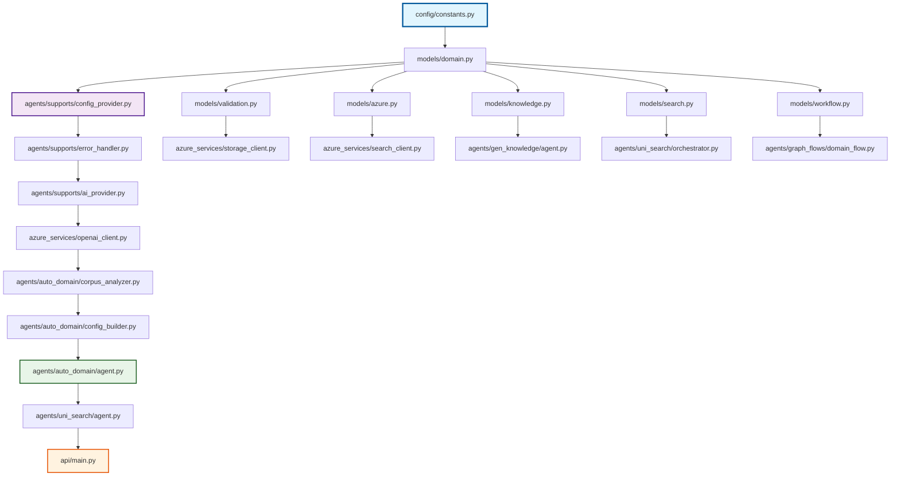

# TODO-Driven Implementation Guide

**Universal RAG Azure - Systematic Implementation Methodology**

## 🎯 Overview

This guide establishes the **TODO + Basic Code Implementation Pattern** as the official methodology for implementing the Universal RAG Azure system. This approach enables **zero-hardcoded-values architecture** while providing **practical, incremental implementation**.

## Table of Contents

- [Core Implementation Pattern](#core-implementation-pattern)
- [Implementation Rules](#implementation-rules)
- [Complete Implementation Roadmap](#complete-implementation-roadmap)
- [File Dependencies](#file-dependencies)
- [Quality Standards](#quality-standards)
- [Validation Process](#validation-process)
- [Success Metrics](#success-metrics)

## Core Implementation Pattern

### **The TODO + Basic Code Pattern**

Every method implementation follows this exact structure:

```python
async def method_name(self, params) -> ReturnType:
    """Method description."""
    # TODO: Comprehensive implementation guidance (PRESERVE)
    # TODO: Architectural requirements (PRESERVE)
    # TODO: Advanced features to implement later (PRESERVE)
    
    # === BASIC IMPLEMENTATION BELOW ===
    # Basic working implementation that demonstrates the pattern
    # Uses centralized constants, no hardcoded values
    # Fulfills the basic requirements from TODOs above
    
    return result
```

### **Before/After Example**

**❌ BEFORE (TODO-only, unimplementable):**
```python
async def analyze_corpus(self, domain_path: str) -> CorpusAnalysis:
    """Basic corpus analysis - simplified version."""
    # TODO: Count documents in domain directory
    # TODO: Calculate basic statistics (total docs, avg length)
    # TODO: Return basic corpus analysis result
    pass
```

**✅ AFTER (TODO + Basic Implementation):**
```python
async def analyze_corpus(self, domain_path: str) -> CorpusAnalysis:
    """Basic corpus analysis - simplified version."""
    # TODO: Count documents in domain directory
    # TODO: Calculate basic statistics (total docs, avg length)
    # TODO: Return basic corpus analysis result
    
    import os
    from datetime import datetime
    
    # Count documents in directory
    doc_files = [f for f in os.listdir(domain_path) if f.endswith('.md')]
    doc_count = len(doc_files)
    
    # Calculate basic statistics
    total_tokens = 0
    for file in doc_files:
        with open(os.path.join(domain_path, file), 'r') as f:
            total_tokens += len(f.read().split())
    
    avg_length = total_tokens / doc_count if doc_count > 0 else 0
    
    return CorpusAnalysis(
        domain=os.path.basename(domain_path),
        analysis_timestamp=datetime.now(),
        statistics=DomainStatistics(
            document_count=doc_count,
            total_tokens=total_tokens,
            avg_document_length=avg_length,
            vocabulary_size=0,  # Basic implementation - count unique words later
            technical_density=0.5,  # Basic default - learn from content later
            complexity_score=0.6  # Basic default - calculate from patterns later
        ),
        quality_metrics={"basic_analysis": 1.0},
        recommendations=["corpus_analyzed_successfully"]
    )
```

## Implementation Rules

### **Rule 1: Preserve All TODOs**
- ✅ **NEVER remove or modify existing TODOs**
- ✅ **TODOs serve as implementation guidance and architecture documentation**
- ✅ **TODOs show the upgrade path to advanced features**

### **Rule 2: Add Basic Implementation Below TODOs**
- ✅ **Add working code beneath the TODOs with clear separator comment**
- ✅ **Use `# === BASIC IMPLEMENTATION BELOW ===` to separate**
- ✅ **Basic implementation must fulfill the basic TODO requirements**

### **Rule 3: Zero Hardcoded Values**
- ✅ **Use centralized constants from `config/constants.py`**
- ✅ **Generate values using algorithmic rules + constants**
- ✅ **Never use magic numbers or hardcoded business values**

### **Rule 4: Maintain Return Type Compliance**
- ✅ **All methods must return the specified Pydantic model types**
- ✅ **Use centralized models from `models/` directory**
- ✅ **Ensure proper type validation and constraints**

### **Rule 5: Keep Implementation Simple**
- ✅ **Basic implementations should be 10-50 lines maximum**
- ✅ **Focus on demonstrating the architectural pattern**
- ✅ **Advanced algorithms remain in commented-out sections**

### **Rule 6: Comment Advanced Features**
- ✅ **Keep all advanced methods in commented-out sections**
- ✅ **Use standardized separator: `# TEMPORARILY COMMENTED OUT ADVANCED FEATURES`**
- ✅ **Advanced features will be uncommented once basic system works**

## Complete Implementation Roadmap

### **Phase 1: Foundation Layer (Week 1)**

Core infrastructure that enables zero-hardcoded-values architecture.

#### **Priority 1.1: Configuration & Constants**
```
1. ✅ config/constants.py                     # COMPLETED - Centralized constants
2. ✅ models/domain.py                        # COMPLETED - Basic field definitions
3. ✅ agents/supports/config_provider.py     # COMPLETED - Basic config generation
```

#### **Priority 1.2: Core Support Infrastructure**
```
4. agents/supports/error_handler.py          # Basic error handling with structured models
5. agents/supports/ai_provider.py            # Basic OpenAI client wrapper
6. models/validation.py                      # Basic validation result models
7. models/azure.py                           # Basic Azure service models
```

#### **Priority 1.3: Basic Azure Services**
```
8. azure_services/openai_client.py          # Basic completion + embedding methods
9. azure_services/storage_client.py         # Basic blob operations
10. azure_services/search_client.py         # Basic vector search operations
```

### **Phase 2: Domain Analysis Chain (Week 2)**

Implements the corpus → configuration generation pipeline.

#### **Priority 2.1: Core Domain Analysis**
```
11. agents/auto_domain/corpus_analyzer.py   # Basic document counting + stats
12. agents/auto_domain/config_builder.py    # Basic config generation from corpus
13. agents/auto_domain/agent.py             # Basic domain analysis orchestration
```

#### **Priority 2.2: Supporting Models**
```
14. models/knowledge.py                     # Basic knowledge extraction models
15. models/search.py                        # Basic search request/response models
16. models/workflow.py                      # Basic workflow state models
```

#### **Priority 2.3: Pattern Learning (Simplified)**
```
17. agents/auto_domain/pattern_learner.py   # Basic pattern discovery (simplified)
18. agents/auto_domain/domain_deps.py       # Basic dependency injection
19. agents/auto_domain/domain_tools.py      # Basic domain analysis tools
```

### **Phase 3: Search Operations (Week 3)**

Implements the tri-modal search system using generated configurations.

#### **Priority 3.1: Basic Search Infrastructure**
```
20. agents/uni_search/agent.py              # Basic search orchestration
21. agents/uni_search/orchestrator.py       # Basic tri-modal coordination
22. agents/uni_search/search_deps.py        # Basic search dependencies
23. agents/uni_search/search_tools.py       # Basic search tools
```

#### **Priority 3.2: Additional Azure Services**
```
24. azure_services/cosmos_client.py         # Basic graph operations
25. azure_services/ml_client.py             # Basic model inference
26. azure_services/auth/base_client.py      # Basic authentication
```

### **Phase 4: Knowledge Extraction (Week 4)**

Implements entity and relationship extraction using domain configurations.

#### **Priority 4.1: Basic Knowledge Extraction**
```
27. agents/gen_knowledge/agent.py           # Basic knowledge extraction orchestration
28. agents/gen_knowledge/extractor.py       # Basic entity/relationship extraction
29. agents/gen_knowledge/validator.py       # Basic extraction validation
30. agents/gen_knowledge/knowledge_deps.py  # Basic knowledge dependencies
31. agents/gen_knowledge/knowledge_tools.py # Basic extraction tools
```

### **Phase 5: API Layer (Week 5)**

Implements the FastAPI endpoints that expose the functionality.

#### **Priority 5.1: Core API Infrastructure**
```
32. api/main.py                             # Basic FastAPI application setup
33. api/endpoints/search.py                 # Basic search endpoints
```

### **Phase 6: Workflow Orchestration (Week 6)**

Implements the dual-graph workflow system.

#### **Priority 6.1: Workflow Infrastructure**
```
34. agents/graph_flows/domain_flow.py       # Basic domain workflow
35. agents/graph_flows/search_flow.py       # Basic search workflow
36. agents/graph_flows/state_persist.py     # Basic state persistence
```

#### **Priority 6.2: Advanced Support Systems**
```
37. agents/supports/graph_comm.py           # Basic graph communication
38. agents/supports/state_bridge.py         # Basic state bridging
39. agents/supports/perf_monitor.py         # Basic performance monitoring
40. agents/supports/learn_feedback.py       # Basic learning feedback
41. agents/supports/negotiator.py           # Basic configuration negotiation
```

### **Phase 7: Prompt Flows (Week 7)**

Implements the YAML-driven prompt workflow system.

#### **Priority 7.1: Prompt Flow Infrastructure**
```
42. prompt_flows/flow_mgr.py                # Basic flow management
43. prompt_flows/template_mgr.py            # Basic template management
44. prompt_flows/prompt_composer.py         # Basic prompt composition
```

### **Phase 8: Advanced Features (Week 8+)**

Systematically uncomment and implement advanced features.

#### **Priority 8.1: Uncomment Advanced Methods**
- Review each file's commented-out advanced methods
- Implement based on business priorities
- Add sophisticated algorithms incrementally
- Maintain zero-hardcoded-values principle

## File Dependencies

### **Dependency Graph**



### **Critical Path Dependencies**

1. **Constants → Models → ConfigProvider** (Foundation)
2. **ConfigProvider → CorpusAnalyzer → ConfigBuilder** (Configuration Generation)
3. **ConfigBuilder → SearchAgent → API** (Search Operations)
4. **Models → AzureServices → Agents** (Service Integration)

## Quality Standards

### **Code Quality Requirements**

1. **Zero Hardcoded Values**
   - All business values from centralized constants or generated
   - Source tracking in all configurations
   - Pre-commit hooks validate compliance

2. **Type Safety**
   - All methods return structured Pydantic models
   - No `Dict[str, Any]` return types
   - Proper field validation and constraints

3. **TODO Preservation**
   - All existing TODOs maintained as implementation guidance
   - Clear separation between TODOs and implementation
   - Implementation demonstrates TODO requirements

4. **Basic Implementation Standards**
   - 10-50 lines maximum per basic method
   - Focus on architectural pattern demonstration
   - Functional but simplified logic

### **Testing Requirements**

```python
# Each implemented component must have basic tests
def test_basic_functionality():
    """Test that basic implementation works with zero hardcoded values."""
    assert config.similarity_threshold == CONFIG_CONSTANTS.DEFAULT_SIMILARITY_BASE
    assert config.config_source.startswith("generated_from_")
    assert no_hardcoded_values_detected(config)
```

## Validation Process

### **Implementation Checklist**

For each file implementation:

- [ ] All existing TODOs preserved unchanged
- [ ] Basic implementation added below TODOs with clear separator
- [ ] Zero hardcoded values - all from constants or generated
- [ ] Proper return type using centralized Pydantic models
- [ ] Implementation fulfills basic TODO requirements
- [ ] Advanced features remain commented out
- [ ] Pre-commit hooks pass (anti-hardcoding validation)
- [ ] Basic functionality test passes

### **Pre-Commit Validation**

```bash
# Before committing any implementation
pre-commit run --all-files

# Specific anti-hardcoding validation
./scripts/hooks/pre-commit-anti-hardcoding.sh

# Test basic functionality
pytest tests/unit/test_basic_implementation.py -v
```

### **Quality Gates**

1. **Architecture Compliance**: Zero hardcoded values detected
2. **Type Safety**: All return types use centralized models
3. **Functional Testing**: Basic implementation works end-to-end
4. **Documentation Integrity**: TODOs preserved as guidance

## Success Metrics

### **Phase Completion Criteria**

**Phase 1 Success (Foundation):**
- [ ] ConfigProvider generates domain configs using constants
- [ ] Basic error handling works with structured models
- [ ] Azure service clients have basic operations
- [ ] Zero hardcoded values validated by pre-commit hooks

**Phase 2 Success (Domain Analysis):**
- [ ] Corpus analysis counts documents and calculates basic stats
- [ ] Config generation creates DomainConfig from corpus analysis
- [ ] End-to-end: Documents → Analysis → Configuration

**Phase 3 Success (Search Operations):**
- [ ] Search operations use generated domain configurations
- [ ] Tri-modal orchestration works with basic implementations
- [ ] Zero hardcoded search parameters

**Phase 4 Success (Knowledge Extraction):**
- [ ] Entity/relationship extraction uses domain configurations
- [ ] Knowledge validation works with quality thresholds
- [ ] Extraction results feed back to configuration optimization

**Phase 5 Success (API Layer):**
- [ ] FastAPI endpoints expose search functionality
- [ ] API uses generated configurations for all operations
- [ ] Proper error handling and validation

**Phases 6-7 Success (Advanced Features):**
- [ ] Workflow orchestration manages dual-graph communication
- [ ] Prompt flows enable dynamic AI operations
- [ ] Performance monitoring feeds back to configuration learning

### **Overall System Success**

- [ ] **Zero Hardcoded Values**: No business logic values hardcoded anywhere
- [ ] **End-to-End Functionality**: Documents → Configuration → Search → Results
- [ ] **Architecture Preservation**: All TODOs preserved as upgrade guidance
- [ ] **Incremental Enhancement**: Advanced features ready to uncomment and implement
- [ ] **Quality Compliance**: Pre-commit hooks enforce architectural standards

## Implementation Best Practices

### **Developer Workflow**

1. **Start Implementation Session**
   ```bash
   cd universal-rag-azure/
   pre-commit install  # Ensure anti-hardcoding hooks active
   ```

2. **Pick Next File from Roadmap**
   - Follow the dependency order
   - Start with Phase 1 files first

3. **Implement Using Pattern**
   - Preserve all TODOs
   - Add basic implementation below
   - Use centralized constants
   - Return structured models

4. **Validate Before Commit**
   ```bash
   pre-commit run --all-files
   pytest tests/unit/ -v
   ```

5. **Test End-to-End Functionality**
   ```python
   # Test that implementation works with zero hardcoded values
   config = await config_provider.get_domain_config("test_domain")
   assert config.config_source.startswith("generated_from_")
   ```

### **Common Pitfalls to Avoid**

- ❌ **Removing TODOs**: Always preserve existing TODOs as guidance
- ❌ **Hardcoded Values**: Never use magic numbers or business constants
- ❌ **Complex Basic Implementation**: Keep basic implementations simple (10-50 lines)
- ❌ **Skipping Dependencies**: Follow the roadmap dependency order
- ❌ **Generic Return Types**: Always use structured Pydantic models

### **When to Move to Next Phase**

Only proceed to the next phase when:
- All files in current phase have basic implementations
- End-to-end functionality works for the phase
- Pre-commit hooks pass consistently
- Basic tests validate zero-hardcoded-values compliance

---

## 🎯 Summary

This **TODO + Basic Code Implementation Pattern** transforms the Universal RAG Azure system from an unimplementable enterprise vision into a **systematic, incremental development process**. By preserving TODOs as architectural guidance while adding working implementations, we achieve:

1. **Immediate Functionality** - System works at each phase
2. **Zero Hardcoded Values** - Architecture compliance maintained
3. **Clear Upgrade Path** - TODOs guide advanced feature implementation
4. **Risk Mitigation** - Basic implementations prove the architecture works
5. **Developer Productivity** - Clear roadmap with dependencies and success criteria

Follow this guide systematically, and the Universal RAG Azure system will be implemented successfully while maintaining its innovative zero-hardcoded-values architecture and dual-graph communication design.